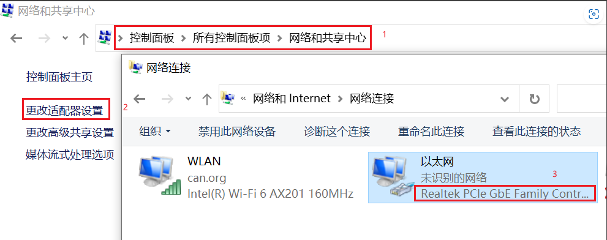
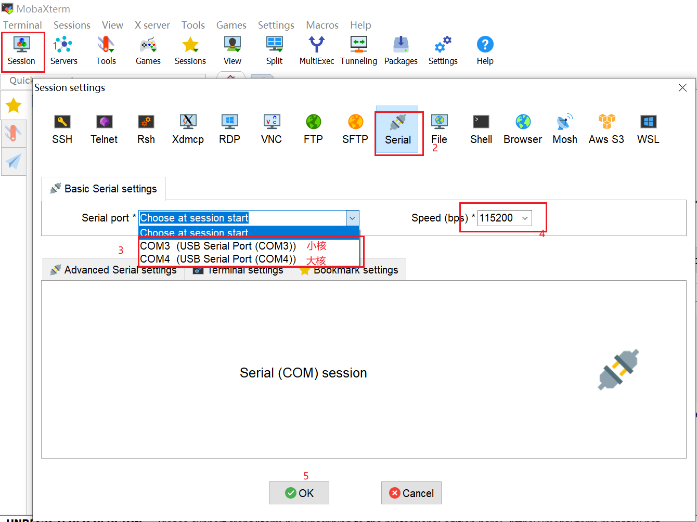

# k230目标检测教程
## 简介 
K230芯片是嘉楠科技 Kendryte®系列AIoT芯片中的最新一代SoC产品。该芯片采用全新的多异构单元加速计算架构，集成了2个RISC-V高能效计算核心，内置新一代KPU（Knowledge Process Unit）智能计算单元，具备多精度AI算力，广泛支持通用的AI计算框架，部分典型网络的利用率超过了70%。
该芯片同时具备丰富多样的外设接口，以及2D、2.5D等多个标量、向量、图形等专用硬件加速单元，可以对多种图像、视频、音频、AI等多样化计算任务进行全流程计算加速，具备低延迟、高性能、低功耗、快速启动、高安全性等多项特性。

本教程将介绍如何使用PyTorch训练目标检测AI模型，并将模型转换为kmodel格式，在嘉楠Kendryte230芯片上部署该模型。
实现该过程需要具备python和C++编程的基础知识，了解linux系统的简单操作，了解一定的深度学习知识，但并不是必须的。
本教程将实现从数据准备、模型训练和测试、k230镜像编译烧录、C++示例代码编译可执行文件、PC端和K230之间网络配置和文件传输、k230端部署的全流程过程。操作系统为linux操作系统，深度学习框架选择PyTorch实现。
本教程选择水果目标检测场景作为示例项目。

## 环境说明
### 显卡环境
本教程默认使用CUDA的用户已经安装好合适的显卡驱动，且已搭建好CUDA环境。
### 安装anaconda
如果已安装anaconda或miniconda，请忽略此步骤。
anaconda用于创建虚拟环境，将PyTorch模型训练环境和其他环境隔离。
```shell
apt-get install -y wget
wget https://repo.anaconda.com/archive/Anaconda3-5.3.0-Linux-x86_64.sh #可以选择合适的版本安装
chmod +x Anaconda3-5.3.0-Linux-x86_64.sh
./Anaconda3-5.3.0-Linux-x86_64.sh
```
出现如下界面：


点击Enter(回车键)

此时显示Anaconda的信息，并且会出现More，继续按Enter，直到如下图所示:


输入 yes


继续点击 Enter


输入 yes，添加环境变量

检查是否安装成功：

```shell
conda -V
```
若返回conda版本，表示安装成功。
### 安装docker
若已安装docker，请忽略此步骤。
Docker官方和国内daocloud都提供了一键安装的脚本，使得Docker的安装更加便捷。
官方的一键安装方式：
```shell
curl -fsSL https://get.docker.com | bash -s docker --mirror Aliyun
```
国内 daocloud一键安装命令：
```shell
curl -sSL https://get.daocloud.io/docker | sh
```
执行上述任一条命令，耐心等待即可完成Docker的安装。
### 创建模型训练环境
```shell
# 使用anaconda创建模型训练的虚拟环境
conda create -n myenv python=3.9
# 激活虚拟环境
conda activate myenv
# 按照项目内的requriements.txt安装训练所用的python库,等待安装
pip install -r requriements.txt
```
在requriments.txt中会安装模型转换的包nncase和nncase-kpu，`nncase 是一个为 AI 加速器设计的神经网络编译器，参考[nncase](https://github.com/kendryte/nncase)。

### 安装dotnet

```shell
wget https://packages.microsoft.com/config/ubuntu/20.04/packages-microsoft-prod.deb -O packages-microsoft-prod.deb
dpkg -i packages-microsoft-prod.deb
apt update
apt install -y apt-transport-https
apt install -y dotnet-sdk-7.0
```
### 添加nncase插件到环境变量
***注意：此步骤需要根据个人机器中实际情况完成。如果使用anaconda虚拟环境，在anaconda安装位置下的envs目录下，选择为训练创建的虚拟环境myenv，在其下面选择lib/python3.9/site-packages/，也就是pip安装requirements.txt内nncase和nncase-kpu的安装位置。source后会退出当前虚拟环境，需要再次激活。如果直接使用机器上的python，则需要添加其下的lib/python3.9/site_packages/。具体python版本自己控制。***
```shell
# python安装路径由自己机器实际情况修改
export NNCASE_PLUGIN_PATH=$NNCASE_PLUGIN_PATH:/usr/local/lib/python3.9/site-packages/
export PATH=$PATH:/usr/local/lib/python3.9/site-packages/
source /etc/profile
conda activate myenv
```
## 使用自定义数据集训练模型
### 组织数据
目标检测任务自定义数据集按照如下格式组织，根目录下包括：以类别名称命名的子目录，子目录中是其类别的所有图像样本。


### 配置训练参数
给出的训练脚本中配置文件config.yaml设置如下：
```yaml
dataset:
  root_folder: ../data/fruit # 目标检测数据集路径
  origion_json: labels.json # 目标检测数据集标注json文件
  split: true # 是否重新执行拆分，第一次执行必须为true
  val_ratio: 0.1 # 验证集比例
  test_ratio: 0.1 # 测试集比例

train_val_test:
  json_dir: ../gen # 拆分过程生成的训练集、验证集、测试集json文件，标签名称文件、校正集文件
  model_save_dir: ../checkpoints # 模型保存路劲
  gpu_index: 0 # 调用的gpu索引，如果gpu不可用，会使用cpu
  img_size: 640 # 分辨率
  learningrate: 0.001 #学习率
  mean: [ 0.485, 0.456, 0.406 ] # 图像标准化均值
  std: [ 0.229, 0.224, 0.225 ] # 图像标准化标准差
  epochs: 300 # 训练迭代次数
  nms_option: false #类内或者类间做nms false代表类内
  pre_train_dir: pre_pth # 预训练模型存放路径
  train_batch_size: 32 # 训练迭代batch
  val_batch_size: 8 # 验证迭代batch
  test_batch_size: 8 # 测试迭代batch

inference:
  mode: image # 推理模式，分为image和video; image模式下可推理单张图片和目录下所有图片，video调用摄像头实现推理
  inference_model: best # 分为best和last，分别调用checkpoints下的best.pth和last.pth进行推理
  image_path: ../data/fruit/test.jpg # 如果该路径为图片路径，则进行单张图片推理；如果该路径为目录，则对目录下所有图片进行推理
  deploy_json: deploy.json # 后续kmodel需要读取的参数文件
  confidence_threshold: 0.55 # 检测框阈值
  nms_threshold: 0.2 # 最大值抑制阈值

deploy:
  onnx_img_size: [640,640] # 转onnx输入分辨率 [w , h]  必须是32的倍数
  chip: k230 # 芯片类型，分为“k230”和“cpu”两种
  ptq_option: 0 # 量化类型，0为uint8，1，2，3，4为uint16的不同形式
```
### 模型训练
进入到工程的scripts目录，执行训练代码：
```shell
python3 main.py
```
如果训练成功，在配置文件的model_save_dir目录下可以找到训练好的last.pth、best.pth、best.onnx、best.kmodel。
### 模型测试推理
设置配置文件中的inference部分，设置测试配置，执行测试代码：
```shell
python3 inference.py
```
## 使用k230部署模型
### 环境准备和镜像编译
K230 SDK需要在**_Linux环境_**下编译，推荐使用Ubuntu Liunx 20.04。
使用docker编译环境，下载[k230_sdk](https://github.com/kendryte/k230_sdk)。

```shell
# 下载sdk
git clone https://github.com/kendryte/k230_sdk.git
cd k230_sdk
# 下载工具链
source tools/get_download_url.sh && make prepare_sourcecode
# 下载官方镜像
docker pull ghcr.io/kendryte/k230_sdk
# 创建docker容器，$(pwd):$(pwd)表示系统当前目录映射到docker容器内部的相同目录下，将系统下的工具链目录映射到docker容器内部的/opt/toolchain目录下
docker run -u root -it -v $(pwd):$(pwd) -v $(pwd)/toolchain:/opt/toolchain -w $(pwd) ghcr.io/kendryte/k230_sdk /bin/bash
# 在docker中编译镜像，请耐心等待完成
make
```
### 镜像烧录
编译结束后在output/k230_evb_defconfig/images目录下可以找到编译好的镜像文件：
```
k230_evb_defconfig/images
├── big-core
├── env.env
├── jffs2.env
├── little-core
├── sysimage-sdcard.img    # SD和emmc非安全启动镜像
├── sysimage-sdcard.img.gz # SD和emmc的非安全启动镜像压缩包
├── sysimage-spinor32m.img # norflash非安全启动镜像
├── sysimage-spinor32m.img.gz    # norflash非安全启动镜像压缩包
└── sysimage-spinor32m_jffs2.img # norflash jffs2非安全启动镜像
```
K230 支持SDCard、eMMC、norflash等多种启动方式，用户可以通过改变开板上启动拔码开关的设置，来切换不同启动模式。 为方便开发，建议您准备一张TF卡，并将拔码开关切换至SD卡启动模式，后续可考虑将镜像文件固化至emmc中。

**烧录TF卡**

详细烧录步骤参考[K230_SDK_使用说明](https://github.com/kendryte/k230_docs/blob/main/zh/01_software/board/K230_SDK_%E4%BD%BF%E7%94%A8%E8%AF%B4%E6%98%8E.md)。

**Linux:** 如使用Linux烧录TF卡,需要先确认SD卡在系统中的名称/dev/sdx, 并替换如下命令中的/dev/sdx

```
sudo dd if=sysimage-sdcard.img of=/dev/sdx bs=1M oflag=sync
```
**Windows:** 如使用Windows烧录, 建议使用[the balena Etcher](https://etcher.balena.io/)工具。将生成的sysimage-sdcard.img下载到本地，使用烧录工具[the balena Etcher](https://etcher.balena.io)进行烧录。

其它更详细的烧录方法，请参考[K230_SDK_使用说明](https://github.com/kendryte/k230_docs/blob/main/zh/01_software/board/K230_SDK_%E4%BD%BF%E7%94%A8%E8%AF%B4%E6%98%8E.md)。

### 上电启动K230 EVB开发板
确认启动开关选择在SD卡启动模式下，将烧录完成的TF卡插入进开板板卡槽中，然后将电源开关K1拔到ON位置，系统可上电。如果您有接好串口，可在串口中看到启动日志输出。 **系统上电后，默认会有二个串口设备，可分别访问小核Linux和大核RTSmart** 大核RTSmart系统中会开机会自动启动一个应用程序，可按q键退出至命令提示符终端。
### PC和k230文件传输配置与实现
#### windows系统
（1）Tftpd64安装，在[https://bitbucket.org/phjounin/tftpd64/downloads/](https://bitbucket.org/phjounin/tftpd64/downloads/)下载。

（2）MobaXterm安装：在[https://mobaxterm.mobatek.net/download.html](https://mobaxterm.mobatek.net/download.html)下载安装。

（2）配置PC网络：




（4）开发板网络配置：

开发板上电，电源线、网线、COM口连接线配置见文档：[K230_SDK_使用说明](https://github.com/kendryte/k230_docs/blob/main/zh/01_software/board/K230_SDK_%E4%BD%BF%E7%94%A8%E8%AF%B4%E6%98%8E.md)。打开MobaXterm，通过两路COM串口连接开发板，COM编号不固定，较小为小核串口，较大为大核串口。



小核进入后回车，进入如下界面，使用root登录：


大核进入后回车，进入如下界面：


在小核配置网络：


大小核共享存储区域：/sharefs


当要从Tftpd64配置的文件中拷贝数据时，在小核界面使用如下命令：

```shell
# 192.168.1.2 为PC的局域网IP
tftp -g -r your_file_name 192.168.1.2
```
当将开发板文件拷贝到PC端Tftpd64配置的文件夹下时，在小核使用如下命令：
```shell
# 192.168.1.2 为PC的局域网IP
tftp -p -r your_file_name 192.168.1.2
```
#### Linux系统
在Linux系统中，PC正常连接网络，开发板可以通过网线连接PC所在网关下其他网口，通过scp命令实现文件传输。

开发板上电，进入大小核COM界面，在小核执行scp传输命令：

```
# 从PC拷贝文件至开发板
scp 用户名@域名或IP:文件所在目录 开发板目的目录
# 从开发板拷贝文件至PC
scp 开发板待拷贝目录 用户名@域名或IP:PC目的目录
```
### 上板code解析
完成上述开发板的准备工作后，我们可以使用C++编写自己的代码，下面就目标检测任务的示例代码进行解析。本教程给出相关目标检测任务的示例代码，并进行简单解析。
#### 代码结构
```
k230_code
├──cmake
	├──link.lds #链接脚本
  	├──Riscv64.cmake
├──k230_deploy
  	├──ai_base.cc # 模型部署基类实现
  	├──ai_base.h # 模型部署基类，封装了nncase加载、input设置、模型推理、获取output操作，后续具体任务开发只需关注模型的前处理、后处理即可
  	├──anchorbase_det.cc # 目标检测code类实现
  	├──anchorbase_det.h # 目标检测类定义，继承AIBase，用于加载kmodel实现目标检测任务,封装模型推理的前后处理
  	├──main.cc # 主函数，参数解析，初始化classification类示例，实现上板功能
  	├──scoped_timing.hpp # 时间测试工具
  	├──utils.cc # 工具类实现 
  	├──utils.h # 工具类, 封装了图像预处理和目标检测任务的常用函数，包括读取二进制文件、保存图片、图像处理、结果绘制等，用户可根据自己需求丰富该文件
  	├──vi_vo.h # 视频输入输出头文件
  	├──CMakeLists.txt # CMake脚本用于构建一个使用C/C++源文件的可执行文件，并链接到各种库
├──build_app.sh # 编译脚本，使用交叉编译工具链编译k230_deploy工程
├──CMakeLists.txt # CMake脚本用于构建 nncase_sdk 的项目工程
```
#### 核心代码
```cpp
/**
 * @brief AI基类，封装nncase相关操作
 * 主要封装了nncase的加载、设置输入、运行、获取输出操作，后续开发demo只需要关注模型的前处理、后处理即可
 */
class AIBase
{
public:
/**
     * @brief AI基类构造函数，加载kmodel,并初始化kmodel输入、输出
     * @param kmodel_file kmodel文件路径
     * @param debug_mode  0（不调试）、 1（只显示时间）、2（显示所有打印信息）
     * @return None
     */
AIBase(const char *kmodel_file,const string model_name, const int debug_mode = 1);

/**
     * @brief AI基类析构函数
     * @return None
     */
~AIBase();

/**
     * @brief 设置kmodel输入
     * @param buf 输入数据指针
     * @param size 输入数据大小
     * @return None
     */
void set_input(const unsigned char *buf, size_t size);

/**
     * @brief 根据索引获取kmodel输入tensor
     * @param idx 输入数据指针
     * @return None
     */
runtime_tensor get_input_tensor(size_t idx);

void set_input_tensor(size_t idx, runtime_tensor &tensor);

/**
     * @brief 初始化kmodel输出
     * @return None
     */
void set_output();

/**
     * @brief 推理kmodel
     * @return None
     */
void run();

/**
     * @brief 获取kmodel输出，结果保存在对应的类属性中
     * @return None
     */
void get_output();


protected:
string model_name_;                    // 模型名字
int debug_mode_;                       // 调试模型，0（不打印），1（打印时间），2（打印所有）
vector<float *> p_outputs_;            // kmodel输出对应的指针列表
vector<vector<int>> input_shapes_;     //{{N,C,H,W},{N,C,H,W}...}
vector<vector<int>> output_shapes_;    //{{N,C,H,W},{N,C,H,W}...}} 或 {{N,C},{N,C}...}}等
vector<int> each_input_size_by_byte_;  //{0,layer1_length,layer1_length+layer2_length,...}
vector<int> each_output_size_by_byte_; //{0,layer1_length,layer1_length+layer2_length,...}
private:
/**
     * @brief 首次初始化kmodel输入，并获取输入shape
     * @return None
     */
void set_input_init();

/**
     * @brief 首次初始化kmodel输出，并获取输出shape
     * @return None
     */
void set_output_init();

// kmodel解释器，从kmodel文件构建，负责模型的加载、输入输出设置和推理
vector<unsigned char> kmodel_vec_; // 通过读取kmodel文件得到整个kmodel数据，用于传给kmodel解释器加载kmodel
interpreter kmodel_interp_; 
};
```
上述代码是ai_base.h文件中AIBase类的定义代码。主要定义了kmodel解释器，kmodel的相关信息，以及输入输出设置、推理过程的接口定义。具体实现在ai_base.cc中。
```cpp
/**
 * @brief 多目标检测
 * 主要封装了对于每一帧图片，从预处理、运行到后处理给出结果的过程
 */
class AnchorBaseDet : public AIBase
{
    public:

    /**
    * @brief AnchorBaseDet构造函数，加载kmodel,并初始化kmodel输入、输出和多目标检测阈值
    * @param args        构建对象需要的参数，config.json文件（包含检测阈值等）
    * @param kmodel_file  kmodel路径
    * @param debug_mode  0（不调试）、 1（只显示时间）、2（显示所有打印信息）
    * @return None
    */
    AnchorBaseDet(config_args args, const char *kmodel_file, const int debug_mode = 1);

    /**
    * @brief AnchorBaseDet构造函数，加载kmodel,并初始化kmodel输入、输出和多目标检测阈值
    * @param args        构建对象需要的参数，config.json文件（包含检测阈值，kmodel路径等）
    * @param kmodel_file  kmodel路径
    * @param isp_shape   isp输入大小（chw）
    * @param vaddr       isp对应虚拟地址
    * @param paddr       isp对应物理地址
    * @param debug_mode  0（不调试）、 1（只显示时间）、2（显示所有打印信息）
    * @return None
    */
    AnchorBaseDet(config_args args, const char *kmodel_file, FrameCHWSize isp_shape, uintptr_t vaddr, uintptr_t paddr,const int debug_mode);
   
    /**
    * @brief AnchorBaseDet析构函数
    * @return None
    */
    ~AnchorBaseDet();

    /**
    * @brief 图片预处理
    * @param ori_img 原始图片
    * @return None
    */
    void pre_process(cv::Mat ori_img);

    /**
    * @brief 视频流预处理（ai2d for isp）
    * @return None
    */
    void pre_process();

    /**
    * @brief kmodel推理
    * @return None
    */
    void inference();

    /**
    * @brief kmodel推理结果后处理
    * @param frame_size 原始图像/帧宽高，用于将结果放到原始图像大小
    * @param results 后处理之后的基于原始图像的检测结果集合
    * @return None
    */
    void post_process(FrameSize frame_size, vector<ob_det_res> &results);

    private:

    /**
    * @brief 检查结果的初步处理
    * @param data 模型输出一层的头指针
    * @param frame_size 原始图像/帧宽高，用于将结果放到原始图像大小
    * @param k 模型的第k层索引
    * @return 处理后的检测框集合
    */
    vector<ob_det_res> decode_infer(float* data, FrameSize frame_size, int k);

    /**
    * @brief 对检测结果进行非最大值抑制
    * @param input_boxes 检测框集合
    * @return None
    */
	void nms(vector<ob_det_res>& input_boxes);
    
    std::unique_ptr<ai2d_builder> ai2d_builder_; // ai2d构建器
    runtime_tensor ai2d_in_tensor_;              // ai2d输入tensor
    runtime_tensor ai2d_out_tensor_;             // ai2d输出tensor
    uintptr_t vaddr_;                            // isp的虚拟地址
    FrameCHWSize isp_shape_;                     // isp对应的地址大小

    float ob_det_thresh;   //检测框分数阈值
    float ob_nms_thresh;   //nms阈值
    vector<string> labels; //类别名字
    int num_class;         //类别数
	int strides[STRIDE_NUM]; //每层检测结果的分辨率缩减被数
	float anchors[3][3][2];  //检测的预设anchor

    int input_height;      //模型输入高
    int input_width;       //模型输入宽

    float *output_0;    //读取kmodel输出
    float *output_1;    //读取kmodel输出
    float *output_2;    //读取kmodel输出
};
```
上述代码是实现目标检测任务的类定义，主要定义目标检测模型推理的前处理、推理、后处理接口。初始化ai2d构建器实现用于图像预处理。还定义了一些目标检测任务的变量，比如类别数、标签列表、检测阈值等。具体实现在anchorbase_det.cc中。
```cpp
void print_usage()
{
    cout << "模型推理时传参说明：" << "<config_file> <kmodel_det> <input_mode> <debug_mode>" << endl
         << "Options:" << endl
         << "  config_file     部署所用json配置文件,默认为 deploy_config.json\n"
         << "  kmodel_det      kmodel路径 \n"
         << "  input_mode      本地图片(图片路径)/ 摄像头(None) \n"
         << "  debug_mode      是否需要调试，0、1、2分别表示不调试、简单调试、详细调试\n"
         << "\n"
         << endl;
}

int main(int argc, char *argv[])
{
    std::cout << "case " << argv[0] << " built at " << __DATE__ << " " << __TIME__ << std::endl;
    if (argc != 5)
    {
        print_usage();
        return -1;
    }
    //video
    if (strcmp(argv[3], "None") == 0)
    {
        std::thread thread_isp(video_proc, argv);
        while (getchar() != 'q')
        {
            usleep(10000);
        }

        isp_stop = true;
        thread_isp.join();
        return -1;
    }
    //image
    else
    {
        image_proc(argv);
        return -1;
    }
}
```
上述代码是main.cc文件中的一部分，主要实现解析传入参数，打印使用说明，实现两个不同分支的推理。如果输入的第二个参数是推理图像路径，则调用image_proc函数进行图像推理；如果传入的是None，则调用video_proc函数进行视频流推理。
```cpp
void image_proc_ob_det(config_args args, char *argv[])
{
    //图像推理代码...
}

void video_proc_ob_det(config_args args, char *argv[])
{
    //视频流推理代码...
}

int video_proc(char *argv[])
{
    config_args args;
    string config = argv[1];
    Utils::parse_args(config, args);
    video_proc_ob_det(args, argv);
    return -1;
}


int image_proc(char *argv[])
{
    config_args args;
    string config = argv[1];
    Utils::parse_args(config, args);
    image_proc_ob_det(args, argv);
    return -1;
}
```
上述代码是main.cc的一部分，主要实现参数解析功能，在image_proc和video_proc中将传入的参数解析出来，调用parse_args函数将目标检测阈值，标签等从deploy.json文件中读出作为参数传递给image_proc_ob_det和video_proc_ob_det调用。
```cpp
void image_proc_ob_det(config_args args, char *argv[])
{
    cv::Mat ori_img = cv::imread(argv[3]);
    int ori_w = ori_img.cols;
    int ori_h = ori_img.rows;
    vector<ob_det_res> results;
    AnchorBaseDet ob_det(args, argv[2], atoi(argv[4]));
    ob_det.pre_process(ori_img);
    ob_det.inference();
    ob_det.post_process({ori_w, ori_h}, results);
    
    Utils::draw_ob_det_res(ori_img,results);
    cv::imwrite("result_ob_det.jpg", ori_img);
}
```
上述代码是main.cc中的图像推理代码部分，首先从图片路径初始化cv::Mat对象ori_img，然后初始化AnchorBaseDet实例ob_det，调用ob_det预处理函数pre_process，推理函数reference，后处理函数post_process，最后调用utils.h中的draw_ob_det_res将结果绘制在图片上并保存为result_ob_det.jpg。如您需要修改前后处理部分，可在AnchorBaseDet.cc中进行修改，如您想添加其他工具方法，可在utils中定义，并在utils.cc中实现。
```cpp
void video_proc_ob_det(config_args args, char *argv[])
{
    vivcap_start();

    k_video_frame_info vf_info;
    void *pic_vaddr = NULL;       //osd

    memset(&vf_info, 0, sizeof(vf_info));

    vf_info.v_frame.width = osd_width;
    vf_info.v_frame.height = osd_height;
    vf_info.v_frame.stride[0] = osd_width;
    vf_info.v_frame.pixel_format = PIXEL_FORMAT_ARGB_8888;
    block = vo_insert_frame(&vf_info, &pic_vaddr);

    // alloc memory
    size_t paddr = 0;
    void *vaddr = nullptr;
    size_t size = SENSOR_CHANNEL * SENSOR_HEIGHT * SENSOR_WIDTH;
    int ret = kd_mpi_sys_mmz_alloc_cached(&paddr, &vaddr, "allocate", "anonymous", size);
    if (ret)
    {
        std::cerr << "physical_memory_block::allocate failed: ret = " << ret << ", errno = " << strerror(errno) << std::endl;
        std::abort();
    }

    vector<ob_det_res> results;

    AnchorBaseDet ob_det(args, argv[2], {SENSOR_CHANNEL, SENSOR_HEIGHT, SENSOR_WIDTH}, reinterpret_cast<uintptr_t>(vaddr), reinterpret_cast<uintptr_t>(paddr), atoi(argv[4]));
    while (!isp_stop)
    {
        ScopedTiming st("total time", 1);

        {
            ScopedTiming st("read capture", atoi(argv[4]));
            // VICAP_CHN_ID_1 out rgb888p
            memset(&dump_info, 0 , sizeof(k_video_frame_info));
            ret = kd_mpi_vicap_dump_frame(vicap_dev, VICAP_CHN_ID_1, VICAP_DUMP_YUV, &dump_info, 1000);
            if (ret) {
                printf("sample_vicap...kd_mpi_vicap_dump_frame failed.\n");
                continue;
            }
        }
            

        {
            ScopedTiming st("isp copy", atoi(argv[4]));
            // 从vivcap中读取一帧图像到dump_info
            auto vbvaddr = kd_mpi_sys_mmap_cached(dump_info.v_frame.phys_addr[0], size);
            memcpy(vaddr, (void *)vbvaddr, SENSOR_HEIGHT * SENSOR_WIDTH * 3);  // 这里以后可以去掉，不用copy
            kd_mpi_sys_munmap(vbvaddr, size);
        }

        results.clear();

        ob_det.pre_process();
        ob_det.inference();

        ob_det.post_process({SENSOR_WIDTH, SENSOR_HEIGHT},results);

        cv::Mat osd_frame(osd_height, osd_width, CV_8UC4, cv::Scalar(0, 0, 0, 0));
        cv::Mat osd_frame_tmp;

        {
            ScopedTiming st("osd draw", atoi(argv[4]));
            Utils::draw_ob_det_res(osd_frame, results, {osd_width, osd_height}, {SENSOR_WIDTH, SENSOR_HEIGHT});
            cv::flip(osd_frame, osd_frame_tmp, 0);
            cv::flip(osd_frame_tmp, osd_frame, 1);
        }


        {
            ScopedTiming st("osd copy", atoi(argv[4]));
            memcpy(pic_vaddr, osd_frame.data, osd_width * osd_height * 4);
            //显示通道插入帧
            kd_mpi_vo_chn_insert_frame(osd_id+3, &vf_info);  //K_VO_OSD0
            printf("kd_mpi_vo_chn_insert_frame success \n");

            ret = kd_mpi_vicap_dump_release(vicap_dev, VICAP_CHN_ID_1, &dump_info);
            if (ret) {
                printf("sample_vicap...kd_mpi_vicap_dump_release failed.\n");
            }
        }
    }
    vo_osd_release_block();
    vivcap_stop();


    // free memory
    ret = kd_mpi_sys_mmz_free(paddr, vaddr);
    if (ret)
    {
        std::cerr << "free failed: ret = " << ret << ", errno = " << strerror(errno) << std::endl;
        std::abort();
    }
}
```
上述代码是main.cc中对视频流进行目标检测操作的部分。下面是详细解析：

- vivcap_start()和 vivcap_stop()函数用于开始和停止视频捕获；
- k_video_frame_info vf_info定义一个 k_video_frame_info 结构体变量 vf_info，用于存储视频帧的信息；
- void *pic_vaddr = NULL定义一个 void 指针 pic_vaddr，用于存储 OSD（On-Screen Display）图像数据；
- memset(&vf_info, 0, sizeof(vf_info))将 vf_info 结构体的内存初始化为零，然后设置视频帧的信息，包括宽度、高度、stride 和像素格式等；
- block = vo_insert_frame(&vf_info, &pic_vaddr)调用 vo_insert_frame 函数插入帧数据；kd_mpi_sys_mmz_alloc_cached 函数分配一块内存，用于存储图像数据，paddr 存储物理地址，vaddr 存储虚拟地址，size 是内存块大小；
- 创建 AnchorBaseDet 对象 ob_det，用于实现目标检测任务；
- 创建一个空的 results 向量，用于存储目标检测结果。
- 进入循环，只要 isp_stop 标志不为真时：

    a. 使用 kd_mpi_vicap_dump_frame 从视频捕获设备中获取一帧图像数据，存储在 dump_info 中；

    b. 通过 kd_mpi_sys_mmap_cached 和 memcpy 将捕获的图像数据复制到之前分配的内存块中；

    c. 清空 results 向量， 调用 ob_det 的预处理方法、推理方法和后处理方法，对图像进行目标检测；

    d. 利用目标检测结果，在 OSD 图像上绘制检测信息;

    e. 使用 memcpy 将 OSD 图像数据复制到之前分配的 OSD 数据块中;

    f. 通过 kd_mpi_vo_chn_insert_frame 将 OSD 图像插入到显示通道;

    g. 通过 kd_mpi_vicap_dump_release 释放之前捕获的图像。

- 循环结束后，释放 OSD 相关的资源，通过 vo_osd_release_block() 和 vivcap_stop() 函数;
- 使用 kd_mpi_sys_mmz_free 释放之前分配的内存块。

通过上述代码实现目标检测任务的视频流推理。
#### 代码流程图


#### k230_code/k230_deploy/CMakeLists.txt脚本说明
```cmake
set(src main.cc utils.cc ai_base.cc json.cpp anchorbase_det.cc)
set(bin main.elf)

include_directories(${PROJECT_SOURCE_DIR})
include_directories(${nncase_sdk_root}/riscv64/rvvlib/include)
include_directories(${k230_sdk}/src/big/mpp/userapps/api/)
include_directories(${k230_sdk}/src/big/mpp/include)
include_directories(${k230_sdk}/src/big/mpp/include/comm)
include_directories(${k230_sdk}/src/big/mpp/userapps/sample/sample_vo)
link_directories(${nncase_sdk_root}/riscv64/rvvlib/)

add_executable(${bin} ${src})
target_link_libraries(${bin} -Wl,--start-group rvv Nncase.Runtime.Native nncase.rt_modules.k230 functional_k230 sys vicap vb cam_device cam_engine
 hal oslayer ebase fpga isp_drv binder auto_ctrol common cam_caldb isi 3a buffer_management cameric_drv video_in virtual_hal start_engine cmd_buffer
 switch cameric_reg_drv t_database_c t_mxml_c t_json_c t_common_c vo sensor atomic dma -Wl,--end-group)

target_link_libraries(${bin} opencv_imgproc opencv_imgcodecs opencv_core zlib libjpeg-turbo libopenjp2 libpng libtiff libwebp csi_cv)
install(TARGETS ${bin} DESTINATION bin)
```
这是k230_code/k230_deploy目录下的CMakeLists.txt脚本，设置编译的C++文件和生成的elf可执行文件名称，由下面：
```shell
set(src main.cc utils.cc ai_base.cc anchorbase_det.cc) 
set(bin main.elf)
```
```shell
● include_directories(${PROJECT_SOURCE_DIR})：添加项目的根目录到头文件搜索路径中。
● include_directories(${nncase_sdk_root}/riscv64/rvvlib/include)：添加 nncase RISC-V 向量库的头文件目录。
● include_directories(${k230_sdk}/src/big/mpp/userapps/api/)：添加 k230 SDK 中的用户应用程序 API 头文件目录。
● include_directories(${k230_sdk}/src/big/mpp/include)：添加 k230 SDK 的一般头文件目录。
● include_directories(${k230_sdk}/src/big/mpp/include/comm)：添加与通信相关的头文件目录。
● include_directories(${k230_sdk}/src/big/mpp/userapps/sample/sample_vo)：添加示例 VO（视频输出）应用程序头文件目录。
```
```cmake
link_directories(${nncase_sdk_root}/riscv64/rvvlib/): 添加链接器搜索路径，指向 nncase RISC-V 向量库的目录。
add_executable(${bin} ${src}): 创建一个可执行文件，将之前设置的源文件列表作为输入。
target_link_libraries(${bin} ...)：设置可执行文件需要链接的库。列表中列出了各种库，包括 nncase 相关的库、k230 SDK 的库，以及其他一些库。
target_link_libraries(${bin} opencv_imgproc opencv_imgcodecs opencv_core zlib libjpeg-turbo libopenjp2 libpng libtiff libwebp csi_cv): 将一些 OpenCV 相关的库和其他一些库链接到可执行文件中。
install(TARGETS ${bin} DESTINATION bin): 安装生成的可执行文件到指定的目标路径（bin 目录）中。
```
上述是k230_code/k230_deploy目录下的CMakeLists.txt脚本说明。
#### k230_code/CMakeLists.txt脚本说明
```cmake
set(src main.cc utils.cc ai_base.cc json.cpp anchorbase_det.cc)
set(bin main.elf)

include_directories(${PROJECT_SOURCE_DIR})
include_directories(${nncase_sdk_root}/riscv64/rvvlib/include)
include_directories(${k230_sdk}/src/big/mpp/userapps/api/)
include_directories(${k230_sdk}/src/big/mpp/include)
include_directories(${k230_sdk}/src/big/mpp/include/comm)
include_directories(${k230_sdk}/src/big/mpp/userapps/sample/sample_vo)
link_directories(${nncase_sdk_root}/riscv64/rvvlib/)

add_executable(${bin} ${src})
target_link_libraries(${bin} -Wl,--start-group rvv Nncase.Runtime.Native nncase.rt_modules.k230 functional_k230 sys vicap vb cam_device cam_engine
 hal oslayer ebase fpga isp_drv binder auto_ctrol common cam_caldb isi 3a buffer_management cameric_drv video_in virtual_hal start_engine cmd_buffer
 switch cameric_reg_drv t_database_c t_mxml_c t_json_c t_common_c vo sensor atomic dma -Wl,--end-group)

target_link_libraries(${bin} opencv_imgproc opencv_imgcodecs opencv_core zlib libjpeg-turbo libopenjp2 libpng libtiff libwebp csi_cv)
install(TARGETS ${bin} DESTINATION bin)
```
这是k230_code目录下的CMakeLists.txt脚本。该脚本重点关注如下部分
```cmake
set(nncase_sdk_root "${PROJECT_SOURCE_DIR}/../../nncase/"):设置nncase目录
set(k230_sdk ${nncase_sdk_root}/../../../):设置k230_sdk的目录，当前是从nncase目录的三级父目录得到
set(CMAKE_EXE_LINKER_FLAGS "-T ${PROJECT_SOURCE_DIR}/cmake/link.lds --static"):设置链接脚本路径，链接脚本放于k230_code/cmake下
...
add_subdirectory(k230_deploy): 添加待编译的工程子目录，如您要编译自己的工程，可以更换该行
```
以上是k230_code目录下的CMakeLists.txt脚本说明。
#### k230_code/build_app.sh脚本说明
```shell
#!/bin/bash
set -x

# set cross build toolchain
# 将交叉编译工具链的路径添加到系统的 PATH 环境变量中，以便在后续的命令中使用。该工具链是使用的大核编译工具链。
export PATH=$PATH:/opt/toolchain/riscv64-linux-musleabi_for_x86_64-pc-linux-gnu/bin/

clear
rm -rf out
mkdir out
pushd out
cmake -DCMAKE_BUILD_TYPE=Release                 \
      -DCMAKE_INSTALL_PREFIX=`pwd`               \
      -DCMAKE_TOOLCHAIN_FILE=cmake/Riscv64.cmake \
      ..

make -j && make install
popd

# 生成的main.elf可以在k230_code目录下的k230_bin文件夹下找到
k230_bin=`pwd`/k230_bin
rm -rf ${k230_bin}
mkdir -p ${k230_bin}

if [ -f out/bin/main.elf ]; then
      cp out/bin/main.elf ${k230_bin}
fi
```
### AI代码编译
将项目中的k230_code文件夹拷贝到k230_sdk目录下的src/big/nncase下，执行编译脚本，将C++代码编译成main.elf可执行文件。
```shell
./build_app.sh
```
若权限不够，可使用如下代码赋予相关权限：
```shell
chmod +x build_app.sh
./build_app.sh
```
### 文件拷贝
按照上文第4节配置好文件传输，在MobaXterm上的小核界面进入/sharefs，将训练得到的checkpoints文件夹下kmodel文件、gen文件夹下deploy.json文件的和编译得到的main.elf文件拷贝到开发板的sharefs目录下新建的项目文件夹test_det下。同时拷贝一张待推理的图片(可以随机在data下选择一张)。
```shell
test_det
├──best.kmodel
├──deploy.json
├──main.elf
├──test.jpg
```
### 模型板上运行
在大核COM口界面执行main.elf实现水果目标检测。
如进行静态图推理，执行下述代码(注意：代码需在大核下执行，文件拷贝需在小核下完成)：

```shell
"模型推理时传参说明：<config_file> <kmodel_det> <input_mode> <debug_mode>"
"Options:"
"  config_file     部署所用json配置文件,默认为 deploy_config.json"
"  kmodel_det      kmodel路径"
"  input_mode      本地图片(图片路径)/ 摄像头(None)"
"  debug_mode      是否需要调试，0、1、2分别表示不调试、简单调试、详细调试"
main.elf deploy.json best.kmodel test.jpg 2 
```
如执行摄像头视频流推理，执行下述代码：
```shell
main.elf deploy.json best.kmodel None 2 
```
### 上板部署效果

保存的识别结果：


## 工具
烧录工具the balena Etcher: [https://etcher.balena.io/](https://etcher.balena.io/)

局域网文件传输工具Tftpd64：[https://bitbucket.org/phjounin/tftpd64/downloads/](https://bitbucket.org/phjounin/tftpd64/downloads/)

MobaXterm下载地址：[https://mobaxterm.mobatek.net/download.html](https://mobaxterm.mobatek.net/download.html)

## 参考
k230_sdk github：[https://github.com/kendryte/k230_sdk](https://github.com/kendryte/k230_sdk)

k230_sdk_doc github: [k230 sdk 使用说明](https://github.com/kendryte/k230_docs/blob/main/zh/01_software/board/K230_SDK_%E4%BD%BF%E7%94%A8%E8%AF%B4%E6%98%8E.md)

k230_sdk gitee: [https://gitee.com/kendryte/k230_sdk](https://gitee.com/kendryte/k230_sdk)

nncase github: [kendryte/nncase: Open deep learning compiler stack for Kendryte AI accelerator (github.com)](https://github.com/kendryte/nncase)

