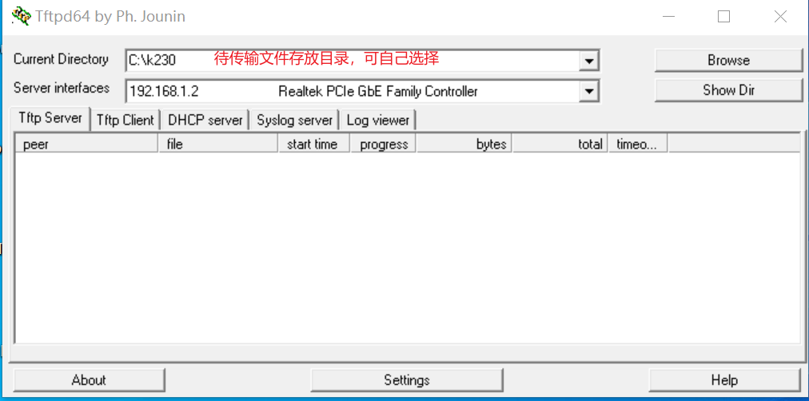

# k230关键词唤醒教程

## 简介

K230芯片是嘉楠科技 Kendryte®系列AIoT芯片中的最新一代SoC产品。该芯片采用全新的多异构单元加速计算架构，集成了2个RISC-V高能效计算核心，内置新一代KPU（Knowledge Process Unit）智能计算单元，具备多精度AI算力，广泛支持通用的AI计算框架，部分典型网络的利用率超过了70%。
该芯片同时具备丰富多样的外设接口，以及2D、2.5D等多个标量、向量、图形等专用硬件加速单元，可以对多种图像、视频、音频、AI等多样化计算任务进行全流程计算加速，具备低延迟、高性能、低功耗、快速启动、高安全性等多项特性。

本教程将介绍如何训练自己的**关键词唤醒**模型，并将模型转换为kmodel格式，部署在嘉楠Kendryte230芯片上。
实现该过程需要具备python和C++编程的基础知识，了解linux系统的简单操作，了解一定的深度学习知识，但并不是必须的。
本教程将实现从数据准备、模型训练和测试、k230镜像编译烧录、C++示例代码编译可执行文件、PC端和K230之间网络配置和文件传输、k230端部署的全部流程。操作系统为linux操作系统，深度学习框架选择PyTorch实现。
本教程选择训练自己的关键词——小楠小楠为例。

## 环境说明

### 显卡环境

本教程默认使用CUDA的用户已经安装好合适的显卡驱动，且已搭建好CUDA环境。

### 安装anaconda

如果已安装anaconda或miniconda，请忽略此步骤。
anaconda用于创建虚拟环境，将PyTorch模型训练环境和其他环境隔离。

```shell
apt-get install -y wget
wget https://repo.anaconda.com/archive/Anaconda3-5.3.0-Linux-x86_64.sh #可以选择合适的版本安装
chmod +x Anaconda3-5.3.0-Linux-x86_64.sh
./Anaconda3-5.3.0-Linux-x86_64.sh
```

出现如下界面：


点击Enter(回车键)

此时显示Anaconda的信息，并且会出现More，继续按Enter，直到如下图所示:


输入 yes


继续点击 Enter


输入 yes，添加环境变量

检查是否安装成功：

```shell
conda -V
```

若返回conda版本，表示安装成功。

### 安装docker

若已安装docker，请忽略此步骤。
Docker官方和国内daocloud都提供了一键安装的脚本，使得Docker的安装更加便捷。
官方的一键安装方式：

```shell
curl -fsSL https://get.docker.com | bash -s docker --mirror Aliyun
```

国内 daocloud一键安装命令：

```shell
curl -sSL https://get.daocloud.io/docker | sh
```

执行上述任一条命令，耐心等待即可完成Docker的安装。

### 创建模型训练环境

```shell
# 使用anaconda创建模型训练的虚拟环境
conda create -n myenv python=3.8.0
# 激活虚拟环境
conda activate myenv
# 按照项目内的requirements.txt安装训练所用的python库,等待安装
pip install -r requirements.txt
```

在requirements.txt中会安装模型转换的包nncase和nncase-kpu，`nncase` 是一个为 AI 加速器设计的神经网络编译器，参考[nncase](https://github.com/kendryte/nncase)。

### 安装dotnet

```shell
wget https://packages.microsoft.com/config/ubuntu/20.04/packages-microsoft-prod.deb -O packages-microsoft-prod.deb
dpkg -i packages-microsoft-prod.deb
apt update
apt install -y apt-transport-https
apt install -y dotnet-sdk-7.0
```

### 添加nncase插件到环境变量

***注意：此步骤需要根据个人机器中实际情况完成。如果使用anaconda虚拟环境，在anaconda安装位置下的envs目录下，选择为训练创建的虚拟环境myenv，在其下面选择lib/python3.9/site-packages/，也就是pip安装requirements.txt内nncase和nncase-kpu的安装位置。source后会退出当前虚拟环境，需要再次激活。如果直接使用机器上的python，则需要添加其下的lib/python3.9/site_packages/。具体python版本自己控制。***

```shell
# python安装路径由自己机器实际情况修改
export NNCASE_PLUGIN_PATH=$NNCASE_PLUGIN_PATH:/usr/local/lib/python3.9/site-packages/
export PATH=$PATH:/usr/local/lib/python3.9/site-packages/
source /etc/profile
conda activate myenv
```

## 准备自己的唤醒词数据

### 组织数据

本方法借助开源数据集speech_commands来训练自己的唤醒词，开发者需要准备两份数据：

1.下载speech_commands_v0.01.tar.gz作为负样本数据。

    # 该数据集下载地址：http://download.tensorflow.org/data/speech_commands_v0.01.tar.gz
    wget http://download.tensorflow.org/data/speech_commands_v0.01.tar.gz

2.在K230开发板上录制wav_from_k230.zip作为正样本。

该数据集需要开发者自行在k230上录制，录制步骤示例：

```shell
cd /sharefs/app

# 创建音频存储文件夹
mkdir wav_from_k230
mkdir wav_from_k230/xiaonanxiaonan
# 如果训练多个唤醒词，需要您按照唤醒词拼音创建所有文件夹
# 比如：
#mkdir wav_from_k230/xiaonantongxue
#mkdir wav_from_k230/nannan

# 在开发板上采集音频,每个唤醒词的音频数据放到对应的文件夹下
./sample_audio.elf -type 0 -samplerate 16000 -bitwidth 16 -channels 1 -enablecodec 1 -filename ./wav_from_k230/xiaonanxiaonan/xiaonan_1.wav

# 将录制的音频从开发板传输到服务器或者主机用于训练
scp wav_from_k230/* your_user_name@your_IP:/path/to/wav_from_k230
```

上述步骤i， ii， iii在大核执行，步骤iv在小核执行，负责将板子上录制的音频发送到开发者自己的服务器以用于模型训练。其中iii重复执行多次并修改保存的wav名称则可以录制多条wav音频。每一个wav音频的长度为15s
，录制者可以在15s内重复多次唤醒词，后续可以根据项目脚本分割为多个含有单个唤醒词的样本。
录制的样本示例可以参考```./resource/xiaonan.wav```

将准备的数据按照以下格式放在项目下的```example/speech_commands_v1```下：

```shell
`-- example
    `-- speech_commands_v1
        |-- s0
        |-- speech_commands_v0.01.tar.gz # 负样本数据集
        `-- wav_from_k230.zip # 正样本数据集
```

### 配置训练参数

模型训练用到的参数文件为```example/speech_commands_v1/s0/conf/ds_tcn.yaml```：

```yaml
dataset_conf:
    filter_conf:
        max_length: 2048
        min_length: 0
    resample_conf:
        resample_rate: 16000
    speed_perturb: false
    feature_extraction_conf:
        feature_type: 'fbank'
        num_mel_bins: 40
        frame_shift: 10
        frame_length: 25
        dither: 1.0
    spec_aug: true
    spec_aug_conf:
        num_t_mask: 1
        num_f_mask: 1
        max_t: 20
        max_f: 10
    shuffle: true
    shuffle_conf:
        shuffle_size: 1500
    batch_conf:
        batch_size: 100

model:
    output_dim: 2   # todo:需要根据自己训练的唤醒词数量修改，2代表只有一个唤醒词，负样本占一个维度
    input_dim: 40   # 输入特征维度
    hidden_dim: 256 # 隐藏层特征维度
    preprocessing:
        type: linear # 预处理层类型
    backbone:
        type: tcn # backbone的类型
        ds: true # 是否depth-wise
        num_layers: 4 # backbone的层数
        kernel_size: 8 # 卷积的kernel size
        dropout: 0.1 # dropout的概率

optim: adam # 优化器
optim_conf:
    lr: 0.001 # 学习率
    weight_decay: 0.0001 

training_config:
    grad_clip: 5
    max_epoch: 100
    log_interval: 10
```

### 模型训练&模型测试&导出kmodel

进入到工程的```example/speech_commands_v1/s0```目录，执行训练代码：

```shell
./run.sh stage stop_stage project_path my_keyword num_keyword gpu_index
# stage 为run.sh脚本的开始阶段
# stop_stage 为run.sh的结束阶段
# project_path 为项目地址的绝对路径，例如我的项目为end2end_kws，其在/mnt/end2end_kws，则该参数为
# end2end_kws_doc，注意：/end2end_kws/这种写法是错误的！
# my_keyword 想训练的关键词，用字母表示，例如小楠小楠=xiaonanxiaonan，多个关键词用“_”连接，比如：xiaonanxiaonan_xiaonantongxue
# num_keyword 关键词数量，一个关键词则为2,两个关键词为3，n个关键词加上负样本总共为n+1
# gpu_index 为GPU索引,'-1'/'0'/1'/'1,2,3',-1为CPU，其他为GPU索引

# run.sh中包含6个阶段：
#    -1阶段为将数据划分为训练集，验证集和测试集
#    0阶段为将数据处理为Kaldi格式的文件
#    1阶段为计算CMVN并组织成模型可以使用的数据格式
#    2阶段为训练模型
#    3阶段平均模型和测试模型准确率
#    4阶段为导出ONNX模型
#    5阶段为导出kmodel模型

# 例如：
./run.sh -1 -1 end2end_kws_doc xiaonanxiaonan 2 0
# 多唤醒词时
# ./run.sh -1 -1 end2end_kws_doc xiaonanxiaonan_xiaonantongxue 3 0
# 表示只执行-1阶段

./run.sh -1 5 end2end_kws_doc xiaonanxiaonan 2 0
# 多唤醒词时
# ./run.sh -1 5 end2end_kws_doc xiaonanxiaonan_xiaonantongxue 3 0
# 上述命令表示使用 GPU 0 完成从数据处理到导出kmodel的整个流程,注意替换自己的项目路径，同时多个唤醒词是必须修改conf/ds_tcn.yaml中的model:output_dim变量，改为唤醒词数目即n+1

# 重训时需要删除example/speech_commands_v1目录下的my_data文件夹
```

如果训练成功，在```example/speech_commands_v1/s0/exp/```路径下可以找到```avg_10.pt```，
```avg_10.onnx```和```avg_10.kmodel```。

## 使用k230部署模型

### 环境准备和镜像编译

**注意：训练环境中nncase和nncase-kpu的版本和SDK的版本要对应，nncase和nncase-kpu版本为2.9.0，SDK版本为1.8。**

K230 SDK需要在**_Linux环境_**下编译，推荐使用Ubuntu Liunx 20.04。
使用docker编译环境，下载[k230_sdk](https://github.com/kendryte/k230_sdk)。

```shell
# 下载docker编译镜像
docker pull ghcr.io/kendryte/k230_sdk
# 可以使用以下命令确认docker镜像拉取成功
docker images | grep k230_sdk
# 下载sdk
git clone https://github.com/kendryte/k230_sdk.git
cd k230_sdk
# 下载工具链，make prepare_sourcecode 会自动下载Linux和RT-Smart toolchain, buildroot package, AI package等. 请确保该命令执行成功并没有Error产生，下载时间和速度以实际网速为准。
make prepare_sourcecode
# 创建docker容器，$(pwd):$(pwd)表示系统当前目录映射到docker容器内部的相同目录下，将系统下的工具链目录映射到docker容器内部的/opt/toolchain目录下
docker run -u root -it -v $(pwd):$(pwd) -v $(pwd)/toolchain:/opt/toolchain -w $(pwd) ghcr.io/kendryte/k230_sdk /bin/bash
```

K230现有多种开发板，本教程支持CANMV-K230-V1.0/V1.1和 01Studio CanMV K230。编译开发板镜像，您可以选择在嘉楠开发者社区下载对应双系统镜像，下载链接见：[嘉楠开发者社区-资料下载](https://developer.canaan-creative.com/resource?selected=0-0-0)

```shell
# 在docker中编译镜像，请耐心等待完成，不同类型开发板编译命令不同
# 如果是CANMV-K230开发板
make CONF=k230_canmv_defconfig
# 如果是01Studio开发板，需要自己编译固件
make CONF=k230_canmv_01studio_defconfig
```

### 镜像烧录

**开发板镜像**：

编译结束后在`output/****_defconfig/images`目录下可以找到编译好的镜像文件：

```
k230_canmv_defconfig/images
├── big-core
├── little-core
├── sysimage-sdcard.img    # SD卡镜像
├── sysimage-sdcard.img.gz # SD卡镜像压缩包
```

**烧录TF卡**

详细烧录步骤参考[CanMV K230 教程 &#8212; K230 Linux+RT-Smart SDK](https://developer.canaan-creative.com/k230/zh/dev/CanMV_K230_%E6%95%99%E7%A8%8B.html#id7)。

### 上电启动开发板

K230 CanMV-K230开发板支持SDCard启动方式、HDMI输出显示，因此，需要准备一张TF卡，此外建议准备一个HDMI显示器。

1. 将烧录完成的TF卡插入开发板TF卡槽中
2. 开发板上电，此时，系统可上电启动

系统上电后，默认会有**两个串口设备**，可分别用于访问小核Linux和大核RTSmart

小核Linux默认用户名root，密码为空。大核RTSmart系统中开机会自动启动一个应用程序，可按`q`键退出至命令提示符终端。

### PC和k230文件拷贝方法

#### 离线拷贝

直接插拔TF卡将需要的文件拷贝到TF卡根目录下。开发板上电后，通过调试串口可在`sharefs` 目录下发现拷贝的文件。

#### windows系统

##### scp拷贝

k230_sdk 1.5版本之后支持连接网线自动获取IP，您可以使用scp拷贝文件。

##### 局域网TFTP拷贝

（1）Tftpd64安装，在[https://bitbucket.org/phjounin/tftpd64/downloads/](https://bitbucket.org/phjounin/tftpd64/downloads/)下载。

（2）MobaXterm安装：在[https://mobaxterm.mobatek.net/download.html](https://mobaxterm.mobatek.net/download.html)下载安装。

（3）配置PC网络：




（4）开发板网络配置：

开发板上电，电源线、网线、COM口连接线配置见文档：[K230_SDK_使用说明](https://github.com/kendryte/k230_docs/blob/main/zh/01_software/board/K230_SDK_%E4%BD%BF%E7%94%A8%E8%AF%B4%E6%98%8E.md)。打开MobaXterm，通过两路COM串口连接开发板，COM编号不固定，较小为小核串口，较大为大核串口。


小核进入后回车，进入如下界面，使用root登录：


大核进入后回车，进入如下界面：


在小核配置网络：


大小核共享存储区域：/sharefs


当要从Tftpd64配置的文件中拷贝数据时，在小核界面使用如下命令：

```shell
# 192.168.1.2 为PC的局域网IP
tftp -g -r your_file_name 192.168.1.2
```

当将开发板文件拷贝到PC端Tftpd64配置的文件夹下时，在小核使用如下命令：

```shell
# 192.168.1.2 为PC的局域网IP
tftp -p -r your_file_name 192.168.1.2
```

#### Linux系统

在Linux系统中，PC正常连接网络，开发板可以通过网线连接PC所在网关下其他网口，通过scp命令实现文件传输。

开发板上电，进入大小核COM界面，在小核执行scp传输命令：

```
# 从PC拷贝文件至开发板
scp 用户名@域名或IP:文件所在目录 开发板目的目录
# 从开发板拷贝文件至PC
scp 开发板待拷贝目录 用户名@域名或IP:PC目的目录
```

### 上板code解析

完成上述开发板的准备工作后，我们可以使用C++编写自己的代码，下面就关键词唤醒任务的示例代码进行解析。本教程给出相关关键词唤醒任务的示例代码，并进行简单解析。

#### 代码结构

```
k230_code
├── kws_stream
  ├── ai_base.cc
  ├── ai_base.h # ai base基类
  ├── audio_stream.h # 封装了实时音频流的一些功能
  ├── blocking_queue.h # 封装了音频预处理用到的blocking queue
  ├── build
  ├── CMakeLists.txt 
  ├── fbank.h # 封装了将音频转换为fbank特征的方法
  ├── feature_pipeline.cc 
  ├── feature_pipeline.h # 封装了整个音频预处理流程
  ├── fft.cc 
  ├── fft.h # 封装了音频预处理傅里叶变换的一些计算方法
  ├── kws.cc
  ├── kws.h # 封装了KWS类，主要实现了预处理，推理和后处理过程
  ├── log.h # 封装了log类
  ├── main.cc # 主函数文件，封装了实时检测音频流的功能
  ├── pcm_data.cc # 封装了解析实时音频流数据的功能
  ├── scoped_timing.hpp # 封装了计算某一scope运行所耗时间的功能
  ├── wav_ctrl.cc # 封装了音频预处理相关函数
├── CMakeLists.txt
├── build_app.sh
```

#### 核心代码

```cpp
/**
 * @brief AI基类，封装nncase相关操作
 * 主要封装了nncase的加载、设置输入、运行、获取输出操作，后续开发demo只需要关注模型的前处理、后处理即可
 */
class AIBase
{
public:
/**
     * @brief AI基类构造函数，加载kmodel,并初始化kmodel输入、输出
     * @param kmodel_file kmodel文件路径
     * @param debug_mode  0（不调试）、 1（只显示时间）、2（显示所有打印信息）
     * @return None
     */
AIBase(const char *kmodel_file,const string model_name, const int debug_mode = 1);

/**
     * @brief AI基类析构函数
     * @return None
     */
~AIBase();

/**
     * @brief 设置kmodel输入
     * @param buf 输入数据指针
     * @param size 输入数据大小
     * @return None
     */
void set_input(const unsigned char *buf, size_t size);

/**
     * @brief 根据索引获取kmodel输入tensor
     * @param idx 输入数据指针
     * @return None
     */
runtime_tensor get_input_tensor(size_t idx);

void set_input_tensor(size_t idx, runtime_tensor &tensor);

/**
     * @brief 初始化kmodel输出
     * @return None
     */
void set_output();

/**
     * @brief 推理kmodel
     * @return None
     */
void run();

/**
     * @brief 获取kmodel输出，结果保存在对应的类属性中
     * @return None
     */
void get_output();


protected:
string model_name_;                    // 模型名字
int debug_mode_;                       // 调试模型，0（不打印），1（打印时间），2（打印所有）
vector<float *> p_outputs_;            // kmodel输出对应的指针列表
vector<vector<int>> input_shapes_;     //{{N,C,H,W},{N,C,H,W}...}
vector<vector<int>> output_shapes_;    //{{N,C,H,W},{N,C,H,W}...}} 或 {{N,C},{N,C}...}}等
vector<int> each_input_size_by_byte_;  //{0,layer1_length,layer1_length+layer2_length,...}
vector<int> each_output_size_by_byte_; //{0,layer1_length,layer1_length+layer2_length,...}
private:
/**
     * @brief 首次初始化kmodel输入，并获取输入shape
     * @return None
     */
void set_input_init();

/**
     * @brief 首次初始化kmodel输出，并获取输出shape
     * @return None
     */
void set_output_init();

// kmodel解释器，从kmodel文件构建，负责模型的加载、输入输出设置和推理
vector<unsigned char> kmodel_vec_; // 通过读取kmodel文件得到整个kmodel数据，用于传给kmodel解释器加载kmodel
interpreter kmodel_interp_; 
};
```

上述代码是ai_base.h文件中AIBase类的定义代码。主要定义了kmodel解释器，kmodel的相关信息，以及输入输出设置、推理过程的接口定义。具体实现在ai_base.cc中。

```cpp
/**
 * @brief KWS——关键词唤醒
 * 封装了利用麦克风实时关键词唤醒的过程
 */
class KWS : public AIBase
{
    public:
        /**
        * @brief KWS构造函数，加载kmodel
        * @param kmodel_file kmodel文件路径
        * @param task_name  任务名称
        * @param num_keyword 关键词数量
        * @param debug_mode  0（不调试）、 1（只显示时间）、2（显示所有打印信息）
        * @return None
        */
        KWS(const char *kmodel_file, const std::string task_name, const int num_keyword, const float spot_thresh, const int debug_mode);

        ~KWS();

        bool pre_process(std::vector<float> wav);

        /**
        * @brief kmodel推理
        * @return None
        */
        void inference();

        /**
        * @brief kmodel推理结果后处理
        * @return None
        */
        std::string post_process();

        static wenet::FeaturePipelineConfig feature_config; // 音频预处理类
        static wenet::FeaturePipeline feature_pipeline;     // 音频预处理类


    private:
        int num_bin = 40;                     // 音频特征维度
        const int chunk_size = 30;            // 推理块大小
        const std::string task_name;          // 音频位置
        const int batch_size = 1;             // 音频预处理默认参数，不可更该！
        const int hidden_dim = 256;           // 隐藏层维度
        const int cache_dim = 105;            // in_cache最后一维数量, 与模型参数绑定，不可更改！
        const int num_keyword;                // 唤醒词数量, 包含Deactivated！
        const float spot_thresh;              // 唤醒阈值
        std::vector<string> idx2res;          // ID与唤醒词的映射
        runtime_tensor wav_feature;           // Kmodel输入
        runtime_tensor in_cache;              // Kmodel输入
        std::vector<std::vector<float>> cache;// 用于保存模型每次推理输出的cache, cache用于流式推理
};
#endif
```

上述代码是实现实时关键词唤醒任务的类定义，主要定义关键词唤醒模型推理的前处理、推理、后处理接口。

```cpp
void print_usage(const char *name)
{
    cout << "Usage: " << name << "<kmodel_kws> <num_keyword> <task_name> <debug_mode>" << endl
         << "Options:" << endl
         << "  kmodel_kws       语音唤醒 kmodel路径\n"
         << "  task_name        任务名称\n"
         << "  num_keyword      关键词数量\n"
         << "  spot_thresh      唤醒词激活阈值\n"
         << "  debug_mode       是否需要调试, 0、1、2分别表示不调试、简单调试、详细调试\n"
         << "\n"
         << endl;
}

int main(int argc, char *argv[])
{
    std::cout << "case " << argv[0] << " built at " << __DATE__ << " " << __TIME__ << std::endl;
    if (argc != 6)
    {
        print_usage(argv[0]);
        return -1;
    }

    else
    {
        std::thread thread_isp(video_proc, argv);
        while (getchar() != 'q')
        {
            usleep(10000);
        }

        audio_stop = true;
        thread_isp.join();
    }
    return 0;
}
```

上述代码是main.cc的一部分，主要实现参数解析功能。

```cpp
    bool enable_audio_input = true;
    bool enable_audio_output = true;
    bool disable_audio_input = true;  //disable必须要和enable对应
    bool disable_audio_output = true; //disable必须要和enable对应

    if (K_SUCCESS != start_aio_stream(enable_audio_input, enable_audio_output))
    {
        std::cout << "start_aio_stream failed\n" << std::endl;
    }
```

上述代码是main.cc中开启音频流的代码，k230录音的必备动作。

```cpp
while (!audio_stop)
    {
        ScopedTiming st("total time", 1);

        // 获取音频流数据
        auto pcm_chunk = get_audio_chunk();
        k_u16 *pcm_data = pcm_chunk.first;
        k_u32  pcm_size = pcm_chunk.second;

        // 将PCM数据由uint16 -> int16_t -> float, 以满足PCM数据处理接口的输入要求
        float* data_;
        data_ = new float[pcm_size];
        for (int i = 0; i < pcm_size; i++){
            int16_t sample;
            sample = pcm_data[i];
            data_[i] = static_cast<float>(sample);
        }
        std::vector<float> wav(data_, data_+pcm_size);

        std::cout << "=============================================" << std::endl;

        // 将音频流PCM数据处理为音频Fbank特征
        bool ok = kws.pre_process(wav);

        // 模型推理
        kws.inference();

        // 获得检测结果
        std::string results = kws.post_process();

        if (results == "Deactivated!"){
            std::cout << "Deactivated!" << std::endl;
        }
        else{
            std::cout << results << std::endl;
            std::srand(static_cast<unsigned int>(std::time(nullptr)));
            std::default_random_engine randomEngine(std::rand());
            std::uniform_int_distribution<int> distribution(0, reply_wav_list.size() - 1);
            int index = distribution(randomEngine);
            const char * reply_wav_file = reply_wav_list[index];
            const char *reply_wav = reply_wav_file;
            if (K_SUCCESS != play_wav(reply_wav))
            {
                std::cout << "play_wav failed\n" << std::endl;
            }
        }

    }
```

上述代码是main.cc中对音频流进行实时关键词检测的过程。

#### ```k230_code/k230_deploy/CMakeLists.txt```脚本说明

配置编译文件和需要的头文件，同时链接编译使用的库。

```cmake
set(src main.cc kws.cc fft.cc feature_pipeline.cc ai_base.cc pcm_data.cc wav_ctrl.cc)
set(bin kws_stream.elf)

include_directories(${PROJECT_SOURCE_DIR})
include_directories(${nncase_sdk_root}/riscv64/rvvlib/include)
include_directories(${k230_sdk}/src/big/mpp/userapps/api/)
include_directories(${k230_sdk}/src/big/mpp/include)
include_directories(${k230_sdk}/src/big/mpp/include/comm)
include_directories(${k230_sdk}/src/big/mpp/userapps/sample/sample_vo)
include_directories(${k230_sdk}/src/big/mpp/userapps/sample/sample_audio)
link_directories(${nncase_sdk_root}/riscv64/rvvlib/)

add_executable(${bin} ${src})
target_link_libraries(${bin} -Wl,--start-group rvv Nncase.Runtime.Native nncase.rt_modules.k230 functional_k230 sys vicap vb cam_device cam_engine
 hal oslayer ebase fpga isp_drv binder auto_ctrol common cam_caldb isi 3a buffer_management cameric_drv video_in virtual_hal start_engine cmd_buffer
 switch cameric_reg_drv t_database_c t_mxml_c t_json_c t_common_c vo connector sensor atomic dma -Wl,--end-group ai ao)

target_link_libraries(${bin} opencv_imgcodecs opencv_imgproc opencv_core zlib libjpeg-turbo libopenjp2 libpng libtiff libwebp csi_cv)
install(TARGETS ${bin} DESTINATION bin)
```

#### k230_code/CMakeLists.txt脚本说明

配置共用项目使用的头文件和链接库。

```cmake
cmake_minimum_required(VERSION 3.2)
project(nncase_sdk C CXX)

set(nncase_sdk_root "${PROJECT_SOURCE_DIR}/../../nncase/")
set(k230_sdk ${nncase_sdk_root}/../../../)
set(CMAKE_EXE_LINKER_FLAGS "-T ${PROJECT_SOURCE_DIR}/cmake/link.lds --static")

# set opencv
set(k230_opencv ${k230_sdk}/src/big/utils/lib/opencv)
include_directories(${k230_opencv}/include/opencv4/)
link_directories(${k230_opencv}/lib ${k230_opencv}/lib/opencv4/3rdparty)

# set mmz
link_directories(${k230_sdk}/src/big/mpp/userapps/lib)

# set nncase
include_directories(${nncase_sdk_root}/riscv64)
include_directories(${nncase_sdk_root}/riscv64/nncase/include)
include_directories(${nncase_sdk_root}/riscv64/nncase/include/nncase/runtime)
link_directories(${nncase_sdk_root}/riscv64/nncase/lib/)

add_subdirectory(k230_deploy)
```

#### k230_code/build_app.sh脚本说明

```shell
#!/bin/bash
set -x
# set cross build toolchain
export PATH=$PATH:/opt/toolchain/riscv64-linux-musleabi_for_x86_64-pc-linux-gnu/bin/

clear
rm -rf out
mkdir out
pushd out
cmake -DCMAKE_BUILD_TYPE=Release                 \
      -DCMAKE_INSTALL_PREFIX=`pwd`               \
      -DCMAKE_TOOLCHAIN_FILE=cmake/Riscv64.cmake \
      ..

make -j && make install
popd

k230_bin=`pwd`/k230_bin
rm -rf ${k230_bin}
mkdir -p ${k230_bin}

if [ -f out/bin/kws_stream.elf ]; then
      cp out/bin/kws_stream.elf ${k230_bin}
fi
```

### AI代码编译

将项目中的k230_code文件夹拷贝到k230_sdk目录下的src/big/nncase下，执行编译脚本，将C++代码编译成main.elf可执行文件。

如果编译可以在CANMV-K230开发板执行的elf文件：

```shell
# 在k230_SDK根目录下执行
make CONF=k230_canmv_defconfig prepare_memory
# 回到当前项目目录下
./build_app.sh
```

若权限不够，可使用如下代码赋予相关权限：

```shell
chmod +x build_app.sh
./build_app.sh
```

### 文件拷贝

按照上文第4节配置好文件传输，在MobaXterm上的小核界面进入/sharefs，将训练得到的```avg_10.kmodel```和编译得到的```kws_stream.elf```传输到```/sharefs/kws```
目录下，如果没有需要提前创建目录。

```shell
kws
├──reply_wav # 当被唤醒时，响应用户的音频文件，比如：“小楠小楠”，“我在！”，“我在”就是响应音频。
  ├──wozai.wav # “我在！”
  ├──wolaile.wav # “我来了！”
├──avg_10.kmodel # 训练得到的kmodel
├──kws_stream.elf # 编译的可执行文件
```

### 模型板上运行

在大核COM口界面执行main.elf实现关键词唤醒：

```shell
# "模型推理时传参说明："
# Usage: kws_stream.elf<kmodel_kws> <num_keyword> <task_name> <debug_mode>
#Options:
#  kmodel_kws       语音唤醒 kmodel路径
#  task_name        任务名称
#  num_keyword      关键词数量
#  spot_thresh      唤醒词激活阈值
#  debug_mode       是否需要调试, 0、1、2分别表示不调试、简单调试、详细调试
kws_stream.elf avg_10.kmodel xiaonan 2 0.5 0
```

### 上板部署效果

我们多次唤醒小楠小楠，它随机选择```reply_wav```文件夹下的响应音频给出响应：

小楠响应“叫我干嘛”：

<audio controls>
  <source src="./resource/叫我干嘛.mp3" type="audio/mpeg">
</audio>

小楠响应“我在”：

<audio controls>
  <source src="./resource/我在.mp3" type="audio/mpeg">
</audio>

## 工具

烧录工具the balena Etcher: [https://etcher.balena.io/](https://etcher.balena.io/)

局域网文件传输工具Tftpd64：[https://bitbucket.org/phjounin/tftpd64/downloads/](https://bitbucket.org/phjounin/tftpd64/downloads/)

MobaXterm下载地址：[https://mobaxterm.mobatek.net/download.html](https://mobaxterm.mobatek.net/download.html)

## 参考

k230_sdk github：[https://github.com/kendryte/k230_sdk](https://github.com/kendryte/k230_sdk)

k230_sdk_doc github: [k230 sdk 使用说明](https://github.com/kendryte/k230_docs/blob/main/zh/01_software/board/K230_SDK_%E4%BD%BF%E7%94%A8%E8%AF%B4%E6%98%8E.md)

k230_sdk gitee: [https://gitee.com/kendryte/k230_sdk](https://gitee.com/kendryte/k230_sdk)c

nncase github: [kendryte/nncase: Open deep learning compiler stack for Kendryte AI accelerator (github.com)](https://github.com/kendryte/nncase)
