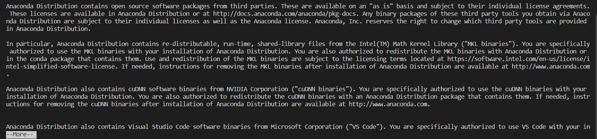
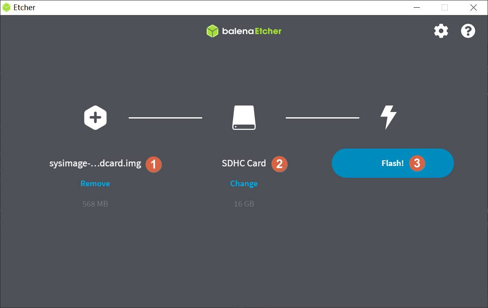
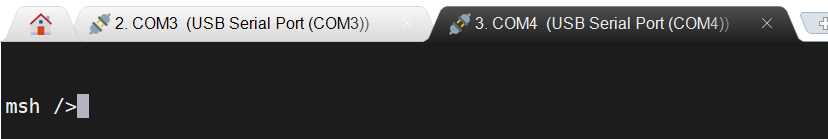

# k230英翻中机器翻译教程
## 简介 
K230芯片是嘉楠科技 Kendryte®系列AIoT芯片中的最新一代SoC产品。该芯片采用全新的多异构单元加速计算架构，集成了2个RISC-V高能效计算核心，内置新一代KPU（Knowledge Process Unit）智能计算单元，具备多精度AI算力，广泛支持通用的AI计算框架，部分典型网络的利用率超过了70%。
该芯片同时具备丰富多样的外设接口，以及2D、2.5D等多个标量、向量、图形等专用硬件加速单元，可以对多种图像、视频、音频、AI等多样化计算任务进行全流程计算加速，具备低延迟、高性能、低功耗、快速启动、高安全性等多项特性。

本教程将介绍如何使用PyTorch训练英翻中机器翻译AI模型，并将模型转换为kmodel格式，在嘉楠Kendryte230芯片上部署该模型。
实现该过程需要具备python和C++编程的基础知识，了解linux系统的简单操作，了解一定的深度学习知识，但并不是必须的。
本教程将实现从数据准备、模型训练和测试、k230镜像编译烧录、C++示例代码编译可执行文件、PC端和K230之间网络配置和文件传输、k230端部署的全流程过程。操作系统为linux操作系统，深度学习框架选择PyTorch实现。
本教程选择英翻中机器翻译场景作为示例项目。

## 环境说明
### 显卡环境
本教程默认使用CUDA的用户已经安装好合适的显卡驱动，且已搭建好CUDA环境。
### 安装anaconda
如果已安装anaconda或miniconda，请忽略此步骤。
anaconda用于创建虚拟环境，将PyTorch模型训练环境和其他环境隔离。
```shell
apt-get install -y wget
wget https://repo.anaconda.com/archive/Anaconda3-5.3.0-Linux-x86_64.sh #可以选择合适的版本安装
chmod +x Anaconda3-5.3.0-Linux-x86_64.sh
./Anaconda3-5.3.0-Linux-x86_64.sh
```
出现如下界面：


点击Enter(回车键)

此时显示Anaconda的信息，并且会出现More，继续按Enter，直到如下图所示:



输入 yes


继续点击 Enter


输入 yes，添加环境变量

检查是否安装成功：

```shell
conda -V
```
若返回conda版本，表示安装成功。
### 安装docker
若已安装docker，请忽略此步骤。
Docker官方和国内daocloud都提供了一键安装的脚本，使得Docker的安装更加便捷。
官方的一键安装方式：
```shell
curl -fsSL https://get.docker.com | bash -s docker --mirror Aliyun
```
国内 daocloud一键安装命令：
```shell
curl -sSL https://get.daocloud.io/docker | sh
```
执行上述任一条命令，耐心等待即可完成Docker的安装。
### 创建模型训练环境
```shell
# 使用anaconda创建模型训练的虚拟环境
conda create -n myenv python=3.9
# 激活虚拟环境
conda activate myenv
# 按照项目内的requriements.txt安装训练所用的python库,等待安装
pip install -r requirements.txt
```
在requirements.txt中会安装模型转换的包nncase和nncase-kpu，`nncase 是一个为 AI 加速器设计的神经网络编译器，参考[nncase](https://github.com/kendryte/nncase)。

### 安装dotnet

```shell
wget https://packages.microsoft.com/config/ubuntu/20.04/packages-microsoft-prod.deb -O packages-microsoft-prod.deb
dpkg -i packages-microsoft-prod.deb
apt update
apt install -y apt-transport-https
apt install -y dotnet-sdk-7.0
```
### 添加nncase插件到环境变量
***注意：此步骤需要根据个人机器中实际情况完成。如果使用anaconda虚拟环境，在anaconda安装位置下的envs目录下，选择为训练创建的虚拟环境myenv，在其下面选择lib/python3.9/site-packages/，也就是pip安装requirements.txt内nncase和nncase-kpu的安装位置。source后会退出当前虚拟环境，需要再次激活。如果直接使用机器上的python，则需要添加其下的lib/python3.9/site_packages/。具体python版本自己控制。***
```shell
# python安装路径由自己机器实际情况修改
export NNCASE_PLUGIN_PATH=$NNCASE_PLUGIN_PATH:/usr/local/lib/python3.9/site-packages/
export PATH=$PATH:/usr/local/lib/python3.9/site-packages/
source /etc/profile
conda activate myenv
```
## 使用自定义数据集训练模型
### 组织数据
英翻中机器翻译任务自定义数据集按照如下格式组织，根目录下包括：两种翻译语言的文本文件。


### 配置训练参数
给出的训练脚本中配置文件config.yaml设置如下：
```yaml
dataset:
  root_folder: ../data/TranslateData # 翻译数据集路径
  src_file: corpus.en #被翻译语言数据集文件名 utf-8编码
  tag_file: corpus.ch #翻译目标数据集文件名 utf-8编码
  src_vocab_size: 8000 #被翻译语言自定义词典大小 eg. 8000 16000 32000
  tag_vocab_size: 8000 #翻译目标语言自定义词典大小 eg. 8000 16000 32000
  src_character_coverage: 1 #被翻译语言字符覆盖量  对于字符集丰富的语言(如日语或中文)为0.9995，对于其他字符集较小的语言为1.0。
  tag_character_coverage: 0.9995 #翻译目标语言字符覆盖量   对于字符集丰富的语言(如日语或中文)为0.9995，对于其他字符集较小的语言为1.0。
  split: false # 是否重新执行拆分，第一次执行必须为true
  val_ratio: 0 # 验证集比例 (如果数据集比较小设置为0 不建议设置大于0的数)
  test_ratio: 0 # 测试集比例 (如果数据集比较小设置为0 不建议设置大于0的数)

train_val_test:
  gen_dir: ../gen # 拆分过程生成的训练集、验证集、测试集文件，校正集文件
  model_save_dir: ../checkpoints # 模型保存路径
  gpu_index: 0 # 调用的gpu索引，如果gpu不可用，会使用cpu
  maxlen: 50 # 最大token长度
  learningrate: 0.0001 #学习率
  epochs: 50 # 训练迭代次数
  train_batch_size: 32 # 训练迭代batch
  val_batch_size: 8 # 验证迭代batch
  test_batch_size: 8 # 测试迭代batch

inference:
  inference_model: best # 分为best和last，分别调用checkpoints下的best.pth和last.pth进行推理
  src_sentence: "I miss you." # 被翻译语言句子

deploy:
  chip: k230 # 芯片类型，分为“k230”和“cpu”两种
  ptq_option: 0 # 量化类型，0为uint8，1，2，3，4为uint16的不同形式
```
### 模型训练
进入到工程的scripts目录，执行训练代码：
```shell
python3 main.py
```
如果训练成功，在配置文件的model_save_dir目录下可以找到训练好的last.pth、best.pth、best_encoder.onnx、best_decoder.onnx、best_encoder.kmodel、best_decoder.kmodel。
### 模型测试推理
设置配置文件中的inference部分，设置测试配置，执行测试代码：
```shell
python3 inference.py
```
## 使用k230部署模型
### 环境准备和镜像编译

**注意：训练环境中nncase和nncase-kpu的版本和SDK的版本要对应，nncase和nncase-kpu版本为2.4.0，SDK版本为1.1。**

K230 SDK需要在**_Linux环境_**下编译，推荐使用Ubuntu Liunx 20.04。
使用docker编译环境，下载[k230_sdk](https://github.com/kendryte/k230_sdk)。

```shell
# 下载docker编译镜像
docker pull ghcr.io/kendryte/k230_sdk
# 可以使用以下命令确认docker镜像拉取成功
docker images | grep k230_sdk
# 下载sdk
git clone -b v1.1 --single-branch https://github.com/kendryte/k230_sdk.git
cd k230_sdk
# 下载工具链，make prepare_sourcecode 会自动下载Linux和RT-Smart toolchain, buildroot package, AI package等. 请确保该命令执行成功并没有Error产生，下载时间和速度以实际网速为准。
make prepare_sourcecode
# 创建docker容器，$(pwd):$(pwd)表示系统当前目录映射到docker容器内部的相同目录下，将系统下的工具链目录映射到docker容器内部的/opt/toolchain目录下
docker run -u root -it -v $(pwd):$(pwd) -v $(pwd)/toolchain:/opt/toolchain -w $(pwd) ghcr.io/kendryte/k230_sdk /bin/bash
```
K230现有两种开发板，分别为CANMV-K230-V1.0（以下简称CANMV-K230）和K230-USIP-LP3-EVB（以下简称K230-EVB）。两种开发板区别如图：


```shell
# 在docker中编译镜像，请耐心等待完成，不同类型开发板编译命令不同
# 如果是CANMV-K230开发板
make CONF=k230_canmv_defconfig
# 如果是K230-EVB开发板
make CONF=k230_evb_defconfig
```

SD卡镜像也可在嘉楠开发者社区下载：开发者社区-->资料下载-->K230-->Images。

### 镜像烧录

**CANMV-K230开发板**：

编译结束后在output/k230_canmv_defconfig/images目录下可以找到编译好的镜像文件：

```
k230_canmv_defconfig/images
├── big-core
├── little-core
├── sysimage-sdcard.img    # SD卡镜像
├── sysimage-sdcard.img.gz # SD卡镜像压缩包
```

CANMV-K230开发板支持SD卡镜像启动。

**K230-EVB开发板**：

编译结束后在output/k230_evb_defconfig/images目录下可以找到编译好的镜像文件：

```
k230_evb_defconfig/images
├── big-core
├── little-core
├── sysimage-sdcard.img    # SD和emmc非安全启动镜像
├── sysimage-sdcard.img.gz # SD和emmc的非安全启动镜像压缩包
├── sysimage-spinor32m.img # norflash非安全启动镜像
└── sysimage-spinor32m_jffs2.img # norflash jffs2非安全启动镜像
```

K230 支持SDCard、eMMC、norflash等多种启动方式。

**烧录TF卡**

详细烧录步骤参考[K230_SDK_使用说明](https://github.com/kendryte/k230_docs/blob/main/zh/01_software/board/K230_SDK_%E4%BD%BF%E7%94%A8%E8%AF%B4%E6%98%8E.md)。

**Linux:** 如使用Linux烧录TF卡,需要先确认SD卡在系统中的名称/dev/sdx, 并替换如下命令中的/dev/sdx

```
sudo dd if=sysimage-sdcard.img of=/dev/sdx bs=1M oflag=sync
```
**Windows:** 如使用Windows烧录, 建议使用[the balena Etcher](https://etcher.balena.io/)工具。将生成的sysimage-sdcard.img下载到本地，使用烧录工具[the balena Etcher](https://etcher.balena.io)进行烧录。

其它更详细的烧录方法，请参考[K230_SDK_使用说明](https://github.com/kendryte/k230_docs/blob/main/zh/01_software/board/K230_SDK_%E4%BD%BF%E7%94%A8%E8%AF%B4%E6%98%8E.md)。

### 上电启动K230 EVB开发板
#### K230-EVB开发板上电启动

K230 EVB支持SDCard、eMMC、norflash等多种启动方式，用户可以通过改变开板上启动拔码开关的设置，来切换不同启动模式。 为方便开发，建议您准备一张TF卡，并将**拔码开关切换至SD卡启动模式**，后续可考虑将镜像文件固化至emmc中。

1. 请先**确认启动开关SW1选择在SD卡启动模式**下（详情可参考[开机上电方式](https://github.com/kendryte/k230_docs/blob/main/zh/00_hardware/K230_DEMO_BOARD资源使用指南.md#电源区开机上电方式)）
2. 将烧录完成的TF卡插入开发板TF卡槽中
3. 开发板接上电源
4. **将电源开关K1拔到ON位置**，系统可上电启动
5. 如果您有接好串口，可在串口中看到启动日志输出。

#### CanMV-K230开发板上电启动

K230 CanMV-K230开发板支持SDCard启动方式、HDMI输出显示，因此，需要准备一张TF卡，此外建议准备一个HDMI显示器。

1. 将烧录完成的TF卡插入开发板TF卡槽中
2. 开发板上电，此时，系统可上电启动

系统上电后，默认会有**两个串口设备**，可分别用于访问小核Linux和大核RTSmart

小核Linux默认用户名root，密码为空。大核RTSmart系统中开机会自动启动一个应用程序，可按`q`键退出至命令提示符终端。

### PC和k230文件传输配置与实现
#### windows系统
（1）Tftpd64安装，在[https://bitbucket.org/phjounin/tftpd64/downloads/](https://bitbucket.org/phjounin/tftpd64/downloads/)下载。

（2）MobaXterm安装：在[https://mobaxterm.mobatek.net/download.html](https://mobaxterm.mobatek.net/download.html)下载安装。

（2）配置PC网络：


（4）开发板网络配置：

开发板上电，电源线、网线、COM口连接线配置见文档：[K230_SDK_使用说明](https://github.com/kendryte/k230_docs/blob/main/zh/01_software/board/K230_SDK_%E4%BD%BF%E7%94%A8%E8%AF%B4%E6%98%8E.md)。打开MobaXterm，通过两路COM串口连接开发板，COM编号不固定，较小为小核串口，较大为大核串口。


小核进入后回车，进入如下界面，使用root登录：


大核进入后回车，进入如下界面：



在小核配置网络：


大小核共享存储区域：/sharefs


当要从Tftpd64配置的文件中拷贝数据时，在小核界面使用如下命令：

```shell
# 192.168.1.2 为PC的局域网IP
tftp -g -r your_file_name 192.168.1.2
```
当将开发板文件拷贝到PC端Tftpd64配置的文件夹下时，在小核使用如下命令：
```shell
# 192.168.1.2 为PC的局域网IP
tftp -p -r your_file_name 192.168.1.2
```
#### Linux系统
在Linux系统中，PC正常连接网络，开发板可以通过网线连接PC所在网关下其他网口，通过scp命令实现文件传输。

开发板上电，进入大小核COM界面，在小核执行scp传输命令：

```
# 从PC拷贝文件至开发板
scp 用户名@域名或IP:文件所在目录 开发板目的目录
# 从开发板拷贝文件至PC
scp 开发板待拷贝目录 用户名@域名或IP:PC目的目录
```
### 上板code解析
完成上述开发板的准备工作后，我们可以使用C++编写自己的代码，下面就英翻中机器翻译任务的示例代码进行解析。本教程给出相关英翻中机器翻译任务的示例代码，并进行简单解析。
#### 代码结构
```
k230_code
├──cmake
	├──link.lds #链接脚本
  	├──Riscv64.cmake
├──k230_deploy
  	├──ai_base.cc # 模型部署基类实现
  	├──ai_base.h # 模型部署基类，封装了nncase加载、input设置、模型推理、获取output操作，后续具体任务开发只需关注模型的前处理、后处理即可
  	├──dtranslate.cc # 机器翻译解码器类code实现
  	├──dtranslate.h # 机器翻译解码器类定义，继承AIBase，用于加载kmodel实现机器翻译解码器类,封装模型推理的前后处理
  	├──etranslate.cc # 机器翻译编码器类code实现
  	├──etranslate.h # 机器翻译编码器类定义，继承AIBase，用于加载kmodel实现机器翻译编码器类,封装模型推理的前后处理
  	├──main.cc # 主函数，参数解析，初始化机器翻译编码器和解码器类示例，实现上板功能
  	├──scoped_timing.hpp # 时间测试工具
  	├──CMakeLists.txt # CMake脚本用于构建一个使用C/C++源文件的可执行文件，并链接到各种库
├──build_app.sh # 编译脚本，使用交叉编译工具链编译k230_deploy工程
├──CMakeLists.txt # CMake脚本用于构建 nncase_sdk 的项目工程
├──sentencepiece
  	├──build.sh # 编译脚本，使用交叉编译工具链编译sentencepiece工程
  	├──......
```
#### 核心代码
```cpp
/**
 * @brief AI基类，封装nncase相关操作
 * 主要封装了nncase的加载、设置输入、运行、获取输出操作，后续开发demo只需要关注模型的前处理、后处理即可
 */
class AIBase
{
public:
/**
     * @brief AI基类构造函数，加载kmodel,并初始化kmodel输入、输出
     * @param kmodel_file kmodel文件路径
     * @param debug_mode  0（不调试）、 1（只显示时间）、2（显示所有打印信息）
     * @return None
     */
AIBase(const char *kmodel_file,const string model_name, const int debug_mode = 1);

/**
     * @brief AI基类析构函数
     * @return None
     */
~AIBase();

/**
     * @brief 设置kmodel输入
     * @param buf 输入数据指针
     * @param size 输入数据大小
     * @return None
     */
void set_input(const unsigned char *buf, size_t size);

/**
     * @brief 根据索引获取kmodel输入tensor
     * @param idx 输入数据指针
     * @return None
     */
runtime_tensor get_input_tensor(size_t idx);

void set_input_tensor(size_t idx, runtime_tensor &tensor);

/**
     * @brief 初始化kmodel输出
     * @return None
     */
void set_output();

/**
     * @brief 推理kmodel
     * @return None
     */
void run();

/**
     * @brief 获取kmodel输出，结果保存在对应的类属性中
     * @return None
     */
void get_output();


protected:
string model_name_;                    // 模型名字
int debug_mode_;                       // 调试模型，0（不打印），1（打印时间），2（打印所有）
vector<float *> p_outputs_;            // kmodel输出对应的指针列表
vector<vector<int>> input_shapes_;     //{{N,C,H,W},{N,C,H,W}...}
vector<vector<int>> output_shapes_;    //{{N,C,H,W},{N,C,H,W}...}} 或 {{N,C},{N,C}...}}等
vector<int> each_input_size_by_byte_;  //{0,layer1_length,layer1_length+layer2_length,...}
vector<int> each_output_size_by_byte_; //{0,layer1_length,layer1_length+layer2_length,...}
private:
/**
     * @brief 首次初始化kmodel输入，并获取输入shape
     * @return None
     */
void set_input_init();

/**
     * @brief 首次初始化kmodel输出，并获取输出shape
     * @return None
     */
void set_output_init();

// kmodel解释器，从kmodel文件构建，负责模型的加载、输入输出设置和推理
vector<unsigned char> kmodel_vec_; // 通过读取kmodel文件得到整个kmodel数据，用于传给kmodel解释器加载kmodel
interpreter kmodel_interp_; 
};
```
上述代码是ai_base.h文件中AIBase类的定义代码。主要定义了kmodel解释器，kmodel的相关信息，以及输入输出设置、推理过程的接口定义。具体实现在ai_base.cc中。
```cpp
/**
 * @brief Encoder 输出
 */
typedef struct EncoderStruct
{
    float *encoder_kv; // 经过编码器的编码结果
    int src_token_size; //被翻译句子token长度
} EncoderStruct;


/**
 * @brief 翻译
 * 主要封装了编码器对被翻译的句子，从预处理、运行到后处理给出结果的过程
 */
class ETranslate:public AIBase
{
public:
    /**
     * @brief ETranslate构造函数，加载kmodel,并初始化kmodel输入、输出
     * @param kmodel_file kmodel文件路径
     * @param src_model_file 分词器模型路径
     * @param debug_mode  0（不调试）、 1（只显示时间）、2（显示所有打印信息）
     * @return None
     */
    ETranslate(const char *kmodel_file, const char *src_model_file, const int debug_mode);

    /**
     * @brief ETranslate析构函数
     * @return None
     */
    ~ETranslate();

    /**
     * @brief 被翻译句子预处理
     * @param ori_sen 被翻译句子
     * @return None
     */
    void pre_process(string ori_sen);

    /**
     * @brief kmodel推理
     * @return None
     */
    void inference();

    /**
     * @brief kmodel推理结果后处理
     * @param result 编码器输出结果
     * @return None
     */
    void post_process(vector<EncoderStruct> &result);

    /**
     * @brief 获取最大token长度
     * @return int 返回最大token长度
     */
    int get_maxlen();

private:

    runtime_tensor in_tensor_0;              // 第1个输入tensor 
    runtime_tensor in_tensor_1;             // 第2个输出tensor

    int maxlen;                             //模型最大输入token长度
    int src_token_size;                     //被翻译句子的token长度
    sentencepiece::SentencePieceProcessor sp_src;  //被翻译语言的分词器
    uint8_t *src_mask;                      //被翻译句子的掩码
    int64_t *source_seq;                    //被翻译句子token列表
    int bos_id;                             //被翻译语言的起始符编号
    int eos_id;                             //被翻译语言的终止符编号
    int pad_id;                             //被翻译语言的token pad值
};
```
上述代码是实现机器翻译编码器的类定义，主要定义编码器模型推理的前处理、推理、后处理接口。还定义了一些编码器类的变量，比如token长度、分词器等。具体实现在etranslate.cc中。
```cpp
/**
 * @brief 翻译
 * 主要封装了解码器对被翻译的句子，从预处理、运行到后处理给出结果的过程
 */
class DTranslate:public AIBase
{
public:
    /**
     * @brief DTranslate构造函数，加载kmodel,并初始化kmodel输入、输出
     * @param kmodel_file kmodel文件路径
     * @param tag_model_file 分词器模型路径
     * @param debug_mode  0（不调试）、 1（只显示时间）、2（显示所有打印信息）
     * @return None
     */
    DTranslate(const char *kmodel_file, const char *tag_model_file, const int debug_mode);

    /**
     * @brief DTranslate析构函数
     * @return None
     */
    ~DTranslate();

    /**
     * @brief 解码器预处理
     * @param index 翻译指定位置
     * @param input_y 解码器输入
     * @param encoder_kv 编码器输出
     * @param src_pad_mask 被翻译句子token掩码
     * @return None
     */
    void pre_process(int index, vector<int64_t> &input_y, float *encoder_kv, int src_token_size);

    /**
     * @brief kmodel推理
     * @return None
     */
    void inference();

    /**
     * @brief 解码器kmodel推理结果后处理
     * @param next_index 翻译后的填写位置
     * @param result 解码器输入
     * @param int_res 翻译结果
     * @param stop 是否停止翻译
     * @return None
     */
    void post_process(int next_index, vector<int64_t> &result, vector<int> &int_res, bool *stop);

    /**
     * @brief 解码器解码
     * @param int_res 翻译结果
     * @return string 翻译后的句子
     */
    string decode_post(vector<int> int_res);

private:

    runtime_tensor in_tensor_0;              // 第1个输入tensor 
    runtime_tensor in_tensor_1;             // 第2个输出tensor
    runtime_tensor in_tensor_2;              // 第3个输入tensor 
    runtime_tensor in_tensor_3;             // 第4个输出tensor

    int maxlen;                             //模型最大输入token长度
    int d_model;                            //模型单个token编码长度
    sentencepiece::SentencePieceProcessor sp_tag; //翻译后语言分词器
    uint8_t *dst_mask;                      //翻译后语言句子掩码
    uint8_t *src_dst_mask;                  //翻译前和翻译后句子结合掩码
    int pad_id;                             //翻译后语言的 token pad 值
    int bos_id;                             //翻译后语言的起始符编号
    int eos_id;                             //翻译后语言的终止符编号
    int vocab_size;                         //翻译后语言字典长度
    float *output;                          //编码器模型输出
};
```
上述代码是实现机器翻译解码器的类定义，主要定义解码器模型推理的前处理、推理、后处理接口。还定义了一些解码器类的变量，比如token长度、分词器等。具体实现在dtranslate.cc中。
```cpp
void print_usage(const char *name)
{
	cout << "Usage: " << name << "<kmodel_encoder> <kmodel_decoder> <src_model_file> <tag_model_file> <debug_mode>" << endl
		 << "Options:" << endl
		 << "  kmodel_encoder      编码器kmodel路径\n"
		 << "  kmodel_decoder      解码器kmodel路径\n"
		 << "  src_model_file      原语言分词器模型路径\n"
		 << "  tag_model_file      翻译后语言分词器模型路径\n"
		 << "  debug_mode      是否需要调试，0、1、2分别表示不调试、简单调试、详细调试\n"
		 << "\n"
		 << endl;
}

void translate_proc(char *argv[])
{
    ETranslate encoder(argv[1], argv[3], atoi(argv[5]));
    sync();
    DTranslate decoder(argv[2], argv[4], atoi(argv[5]));
    sync();

    char src_str[400];

    std::vector<int> int_res;
    vector<EncoderStruct> eresult;

    while (true)
    {
        std::cout << "Please enter : " << "(Enter q End)" << std::endl;
        gets(src_str);

        ScopedTiming st("total time", atoi(argv[5]));
        if(string(src_str) == "q")
        {
            break;
        }

        int_res.clear();
        eresult.clear();
    
        encoder.pre_process(string(src_str));
        encoder.inference();
        encoder.post_process(eresult);

        int maxlen = encoder.get_maxlen();
        vector<int64_t> input_y;
        bool tran_stop = false;
        for(int i = 0; i < maxlen-1; i++)
        {
            decoder.pre_process(i, input_y, eresult[0].encoder_kv, eresult[0].src_token_size);
            decoder.inference();
            decoder.post_process(i+1, input_y,int_res, &tran_stop);
            if (tran_stop)
            {
                break;
            }
        }

        string translate_str = decoder.decode_post(int_res);
        std::cout << "Result : " << translate_str << std::endl;
    }

}

int main(int argc, char *argv[])
{
    std::cout << "case " << argv[0] << " built at " << __DATE__ << " " << __TIME__ << std::endl;
    if (argc != 6)
    {
        print_usage(argv[0]);
        return -1;
    }

    translate_proc(argv);
    return 0;
}
```
上述代码是main.cc文件，主要实现解析传入参数，打印使用说明，模型运行过程。

- 创建 ETranslate 对象 encoder，用于实现机器翻译编码器；
- 创建 DTranslate 对象 decoder，用于实现机器翻译解码器；
- 创建一个申请空间的 src_str 数组，用于存储终端读取的原始语言。
- 创建一个 eresult 向量，用于存储编码器输出结果。
- 创建一个 int_res 向量，用于存储解码器输出的token结果。
- 进入循环：

    a. 使用 gets 从终端读取原始语言，存储在 src_str 中；

    b. 如果 src_str 为 'q' 则终止翻译程序；

    c. 清空 eresult 和 int_res 向量， 调用 encoder 和 decoder 的预处理方法、推理方法和后处理方法，对原始语言进行处理；

    d. 将翻译结果打印在终端;

通过上述代码实现机器翻译任务的推理。
#### 代码流程图


#### k230_code/k230_deploy/CMakeLists.txt脚本说明
```cmake
set(src ai_base.cc main.cc etranslate.cc dtranslate.cc)
set(bin main.elf)

include_directories(${PROJECT_SOURCE_DIR})
include_directories(${nncase_sdk_root}/riscv64/rvvlib/include)
include_directories(${nncase_sdk_root}/riscv64/sentencepiece/include/)

link_directories(${nncase_sdk_root}/riscv64/sentencepiece/lib/)
link_directories(${nncase_sdk_root}/riscv64/rvvlib/)

add_executable(${bin} ${src})
target_link_libraries(${bin} sentencepiece.a)
target_link_libraries(${bin} -Wl,--start-group rvv Nncase.Runtime.Native nncase.rt_modules.k230 functional_k230 sys)

install(TARGETS ${bin} DESTINATION bin)

```
这是k230_code/k230_deploy目录下的CMakeLists.txt脚本，设置编译的C++文件和生成的elf可执行文件名称，由下面：
```shell
set(src ai_base.cc main.cc etranslate.cc dtranslate.cc)
set(bin main.elf)
```
```shell
● include_directories(${PROJECT_SOURCE_DIR})：添加项目的根目录到头文件搜索路径中。
● include_directories(${nncase_sdk_root}/riscv64/rvvlib/include)：添加 nncase RISC-V 向量库的头文件目录。
● include_directories(${nncase_sdk_root}/riscv64/sentencepiece/include/)：添加 sentencepiece 库头文件目录。
```
```cmake
link_directories(${nncase_sdk_root}/riscv64/sentencepiece/lib/): 添加链接器搜索路径，指向 sentencepiece 库的目录。
link_directories(${nncase_sdk_root}/riscv64/rvvlib/): 添加链接器搜索路径，指向 nncase RISC-V 向量库的目录。
add_executable(${bin} ${src}): 创建一个可执行文件，将之前设置的源文件列表作为输入。
target_link_libraries(${bin} sentencepiece.a)：设置可执行文件需要链接的sentencepiece库。
target_link_libraries(${bin} -Wl,--start-group rvv Nncase.Runtime.Native nncase.rt_modules.k230 functional_k230 sys)：设置可执行文件需要链接的 nncase库。
install(TARGETS ${bin} DESTINATION bin): 安装生成的可执行文件到指定的目标路径（bin 目录）中。
```
上述是k230_code/k230_deploy目录下的CMakeLists.txt脚本说明。
#### k230_code/CMakeLists.txt脚本说明
```cmake
cmake_minimum_required(VERSION 3.2)
project(nncase_sdk C CXX)

set(nncase_sdk_root "${PROJECT_SOURCE_DIR}/../../nncase/")
set(k230_sdk ${nncase_sdk_root}/../../../)
set(CMAKE_EXE_LINKER_FLAGS "-T ${PROJECT_SOURCE_DIR}/cmake/link.lds --static")

# set mmz
link_directories(${k230_sdk}/src/big/mpp/userapps/lib)

# set nncase
include_directories(${nncase_sdk_root}/riscv64)
include_directories(${nncase_sdk_root}/riscv64/nncase/include)
include_directories(${nncase_sdk_root}/riscv64/nncase/include/nncase/runtime)
link_directories(${nncase_sdk_root}/riscv64/nncase/lib/)

add_subdirectory(k230_deploy)
```
这是k230_code目录下的CMakeLists.txt脚本。该脚本重点关注如下部分
```cmake
set(nncase_sdk_root "${PROJECT_SOURCE_DIR}/../../nncase/"):设置nncase目录
set(k230_sdk ${nncase_sdk_root}/../../../):设置k230_sdk的目录，当前是从nncase目录的三级父目录得到
set(CMAKE_EXE_LINKER_FLAGS "-T ${PROJECT_SOURCE_DIR}/cmake/link.lds --static"):设置链接脚本路径，链接脚本放于k230_code/cmake下
...
add_subdirectory(k230_deploy): 添加待编译的工程子目录，如您要编译自己的工程，可以更换该行
```
以上是k230_code目录下的CMakeLists.txt脚本说明。
#### k230_code/build_app.sh脚本说明
```shell
#!/bin/bash
set -x

# set cross build toolchain
# 将交叉编译工具链的路径添加到系统的 PATH 环境变量中，以便在后续的命令中使用。该工具链是使用的大核编译工具链。
export PATH=$PATH:/opt/toolchain/riscv64-linux-musleabi_for_x86_64-pc-linux-gnu/bin/

clear
rm -rf out
mkdir out
pushd out
cmake -DCMAKE_BUILD_TYPE=Release                 \
      -DCMAKE_INSTALL_PREFIX=`pwd`               \
      -DCMAKE_TOOLCHAIN_FILE=cmake/Riscv64.cmake \
      ..

make -j && make install
popd

# 生成的main.elf可以在k230_code目录下的k230_bin文件夹下找到
k230_bin=`pwd`/k230_bin
rm -rf ${k230_bin}
mkdir -p ${k230_bin}

if [ -f out/bin/main.elf ]; then
      cp out/bin/main.elf ${k230_bin}
fi
```
#### k230_code/sentencepiece/build.sh脚本说明
```shell
#!/bin/bash
set -x

# set cross build toolchain
# 将交叉编译工具链的路径添加到系统的 PATH 环境变量中，以便在后续的命令中使用。该工具链是使用的大核编译工具链。
export PATH=$PATH:/opt/toolchain/riscv64-linux-musleabi_for_x86_64-pc-linux-gnu/bin/

clear
rm -rf build
mkdir build
pushd build

cmake -DCMAKE_BUILD_TYPE=Release                 \
      -DCMAKE_INSTALL_PREFIX=`pwd`               \
      -DCMAKE_TOOLCHAIN_FILE=../cmake/Riscv64.cmake \
      ..

# 生成sentencepiece 分词器库
make -j && make install
popd
```
### AI代码编译
将项目中的k230_code文件夹拷贝到k230_sdk目录下的src/big/nncase下，进入k230_code/sentencepiece文件夹下，执行编译脚本，编译得到build文件夹，在src/big/nncase/riscv64下建立sentencepiece文件夹，将编译得到的src/big/nncase/k230_code/sentencepiece/build文件夹下的lib，include，bin文件夹拷贝到src/big/nncase/riscv64/sentencepiece/下。
进入src/big/nncase/k230_code下，执行编译脚本，将C++代码编译成main.elf可执行文件。K230现有两种开发板，两种开发板编译命令不同，请注意区分。

#### CANMV-K230开发板

如果编译可以在CANMV-K230开发板执行的elf文件：

```shell
# 进入SDK源码根目录
cd /mnt
make CONF=k230_canmv_defconfig prepare_memory
cd /mnt
cd src/big/nncase/k230_code/sentencepiece/
./build.sh
cd ../../riscv64/
mkdir sentencepiece
cp -r ../k230_code/sentencepiece/build/bin ./sentencepiece
cp -r ../k230_code/sentencepiece/build/include ./sentencepiece
cp -r ../k230_code/sentencepiece/build/lib ./sentencepiece
cd ../k230_code/
./build_app.sh
```
#### K230-EVB开发板

如果编译可以在K230-EVB开发板执行的elf文件：

```shell
# 进入SDK源码根目录
cd /mnt
make CONF=k230_evb_defconfig prepare_memory
cd /mnt
cd src/big/nncase/k230_code/sentencepiece/
./build.sh
cd ../../riscv64/
mkdir sentencepiece
cp -r ../k230_code/sentencepiece/build/bin ./sentencepiece
cp -r ../k230_code/sentencepiece/build/include ./sentencepiece
cp -r ../k230_code/sentencepiece/build/lib ./sentencepiece
cd ../k230_code/
./build_app.sh
```

若权限不够，可使用如下代码赋予相关权限：

```shell
chmod +x build.sh
./build.sh
chmod +x build_app.sh
./build_app.sh
```
### 文件拷贝
按照上文第4节配置好文件传输，在MobaXterm上的小核界面进入/sharefs，将训练得到的checkpoints文件夹下kmodel文件、gen文件夹下src.model、tag.model文件的和编译得到的main.elf文件拷贝到开发板的sharefs目录下新建的项目文件夹test_trans下。
```shell
test_trans
├──best_encoder.kmodel
├──best_decoder.kmodel
├──src.model
├──tag.model
├──main.elf
```
### 模型板上运行
在大核COM口界面执行main.elf实现英翻中机器翻译。

```shell
"模型推理时传参说明：<kmodel_encoder> <kmodel_decoder> <src_model_file> <tag_model_file> <debug_mode>
"Options:"
"  kmodel_encoder      编码器kmodel路径\n"
"  kmodel_decoder      解码器kmodel路径\n"
"  src_model_file      原语言分词器模型路径"
"  tag_model_file      翻译后语言分词器模型路径\n"
"  debug_mode      是否需要调试，0、1、2分别表示不调试、简单调试、详细调试"
main.elf best_encoder.kmodel best_decoder.kmodel src.model tag.model 0
```
### 上板部署效果


## 工具
烧录工具the balena Etcher: [https://etcher.balena.io/](https://etcher.balena.io/)

局域网文件传输工具Tftpd64：[https://bitbucket.org/phjounin/tftpd64/downloads/](https://bitbucket.org/phjounin/tftpd64/downloads/)

MobaXterm下载地址：[https://mobaxterm.mobatek.net/download.html](https://mobaxterm.mobatek.net/download.html)

## 参考
k230_sdk github：[https://github.com/kendryte/k230_sdk](https://github.com/kendryte/k230_sdk)

k230_sdk_doc github: [k230 sdk 使用说明](https://github.com/kendryte/k230_docs/blob/main/zh/01_software/board/K230_SDK_%E4%BD%BF%E7%94%A8%E8%AF%B4%E6%98%8E.md)

k230_sdk gitee: [https://gitee.com/kendryte/k230_sdk](https://gitee.com/kendryte/k230_sdk)

nncase github: [kendryte/nncase: Open deep learning compiler stack for Kendryte AI accelerator (github.com)](https://github.com/kendryte/nncase)

